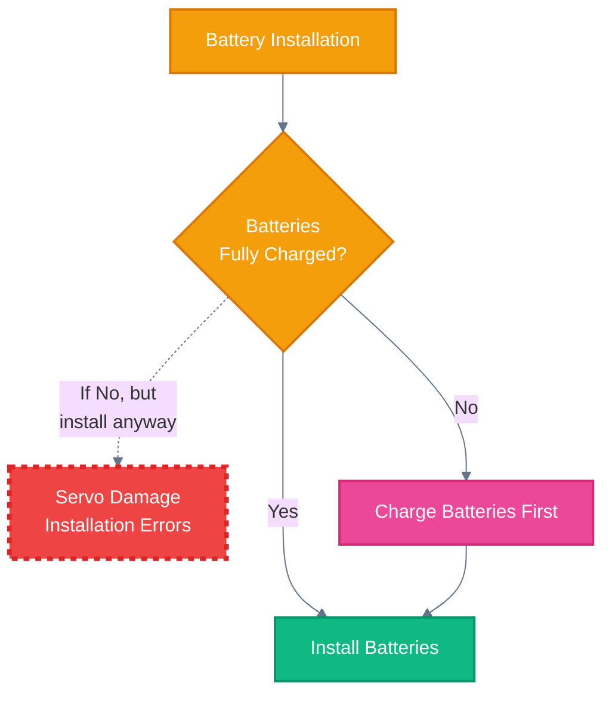
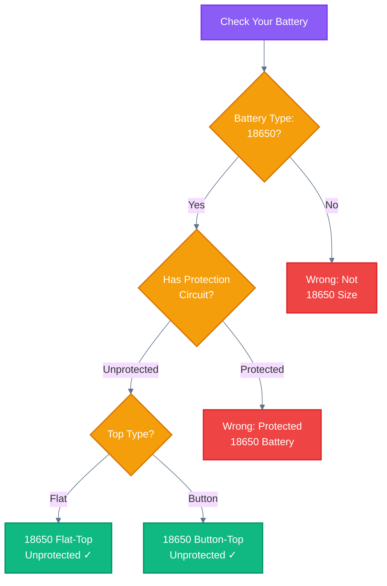
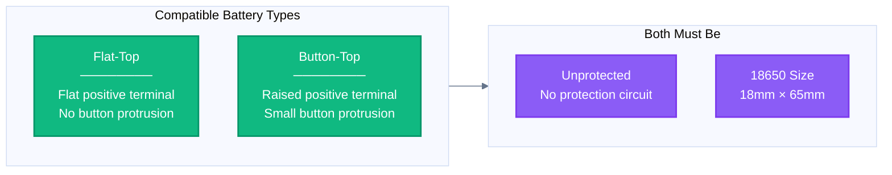
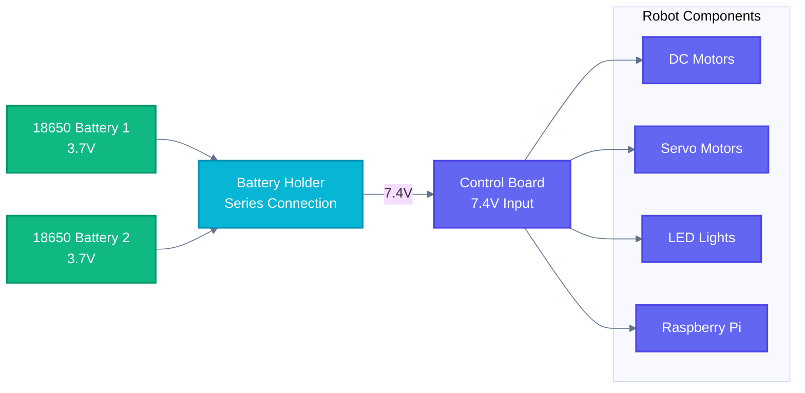

# About Battery

> Essential information for powering your Freenove Tank Robot Kit safely and correctly.

## Critical Safety Warning

> **CRITICAL: Assemble ONLY with fully charged batteries!**
> Installing batteries that are not fully charged will cause servo damage and installation errors.

> **WARNING: USB cable does NOT charge batteries**
> The control board requires a separate 18650 battery charger. Almost any charger suitable for 18650 batteries can be used.

## Do I Have the Right Battery?

As shown in the decision tree above, you need:

- **Size**: 18650 lithium-ion battery
- **Protection**: Unprotected (no circuit board at top)
- **Top Type**: Either Flat-Top or Button-Top

## Battery Types

### Visual Difference

- **Flat-Top**: The positive terminal is flat and flush with the battery top
- **Button-Top**: The positive terminal has a small raised button (nipple)

Both types are compatible with this robot kit, as long as they are **unprotected** 18650 batteries.

## Power Flow

The robot requires **two 18650 batteries** connected in series to provide 7.4V to the control board, which then powers all robot components.

## Purchase Links

Please find the battery description and purchase links on the following pages:

- [18650 Flat-Top Unprotected](https://github.com/Freenove/Freenove_Battery_List/blob/main/18650_Flat-Top_Unprotected.md)
- [18650 Button-Top Unprotected](https://github.com/Freenove/Freenove_Battery_List/blob/main/18650_Button-Top_Unprotected.md)

> **Note**: Some links in the list may be invalid. Please select other available links or purchase independently.

> **Need Help?** If you need assistance or want to report a link failure, please contact support@freenove.com

## Pre-Assembly Checklist

Before you start assembling your robot, verify:

- [ ] You have **two 18650 batteries** (Flat-Top or Button-Top, unprotected)
- [ ] You have a **battery charger** for 18650 batteries
- [ ] Both batteries are **fully charged**
- [ ] You understand that **USB cable does NOT charge the batteries**

Following this checklist prevents servo damage and ensures smooth assembly.
