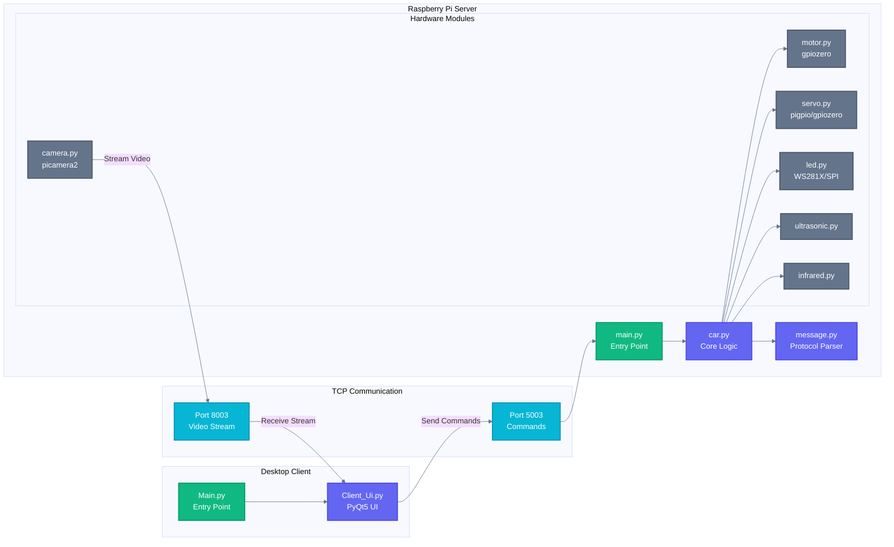
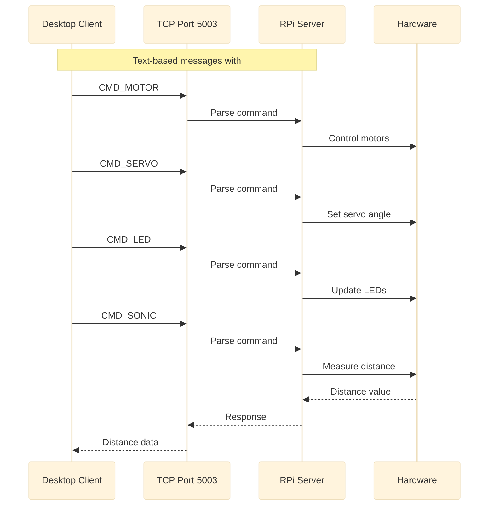
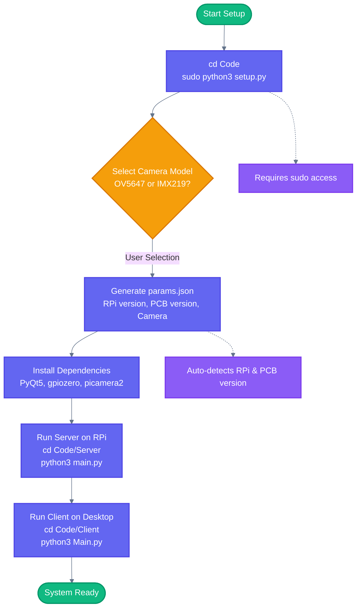

# CLAUDE.md

This file provides guidance to Claude Code (claude.ai/code) when working with code in this repository.

## Project Overview

Freenove Tank Robot Kit for Raspberry Pi - a robotics platform with client-server architecture for controlling a tank-style robot.

## Architecture



**Server** (`Code/Server/`): Runs on Raspberry Pi, controls hardware, streams video
- Entry point: `main.py`
- Core logic: `car.py` coordinates all hardware modules
- Protocol parser: `message.py` with `#` delimiter format

**Client** (`Code/Client/`): Desktop app for remote control
- Entry point: `Main.py`
- UI: `Client_Ui.py` (PyQt5, generated from `Client_Ui.ui`)

## Communication Protocol



**Protocol Format**: Text-based TCP messages using `#` separator
- `CMD_MOTOR#duty1#duty2` - Motor control (-4095 to 4095)
- `CMD_SERVO#channel#angle` - Servo control (0-180)
- `CMD_LED#mode#r#g#b#brightness` - LED control
- `CMD_SONIC` - Request ultrasonic measurement
- `CMD_ACTION#action_id` - Predefined actions

See `Communication Protocol.pdf` for full specification.

## Hardware Compatibility

| Component | PCB V1.0 | PCB V2.0 |
|-----------|----------|----------|
| Servo GPIOs | 7, 8 | 12, 13 |
| Infrared Pins | 16, 20, 21 | 16, 26, 21 |
| LED Driver | GPIO18 WS281X | GPIO10 SPI |
| Best RPi | RPi 4 | RPi 5 |

**Critical**: RPi 5 cannot use pigpio or WS281X driver with PCB V1.0

## Setup



**Setup Commands**:

```bash
# Raspberry Pi setup (requires sudo, prompts for camera model)
cd Code && sudo python3 setup.py

# Run server on Pi
cd Code/Server && python3 main.py

# Run client on desktop
cd Code/Client && python3 Main.py
```

## Configuration

`params.json` (auto-generated in Server/) stores:
- Raspberry Pi version (3/4/5)
- PCB version (1.0/2.0)
- Camera model (OV5647/IMX219)
- Camera port for RPi 5

## Key Dependencies

- **PyQt5**: UI framework (both client and server)
- **gpiozero**: GPIO abstraction for motors/servos
- **pigpio**: Advanced GPIO (RPi 4 only, not compatible with RPi 5)
- **picamera2**: Camera streaming
- **numpy/opencv2**: Computer vision

## License

Creative Commons Attribution-NonCommercial-ShareAlike 3.0 - **Commercial use NOT permitted**
