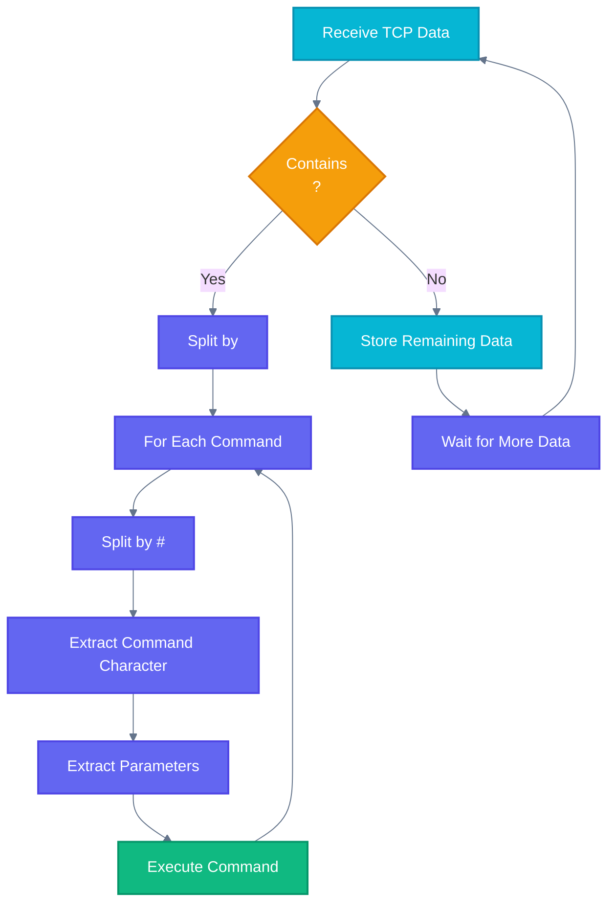
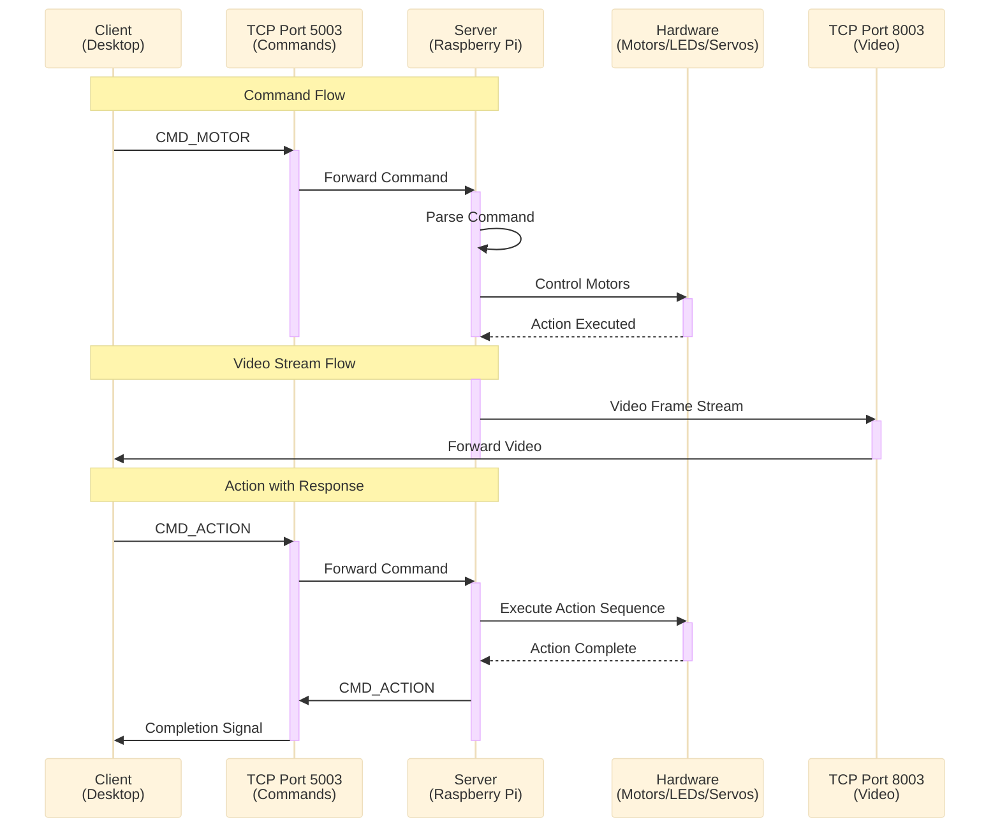
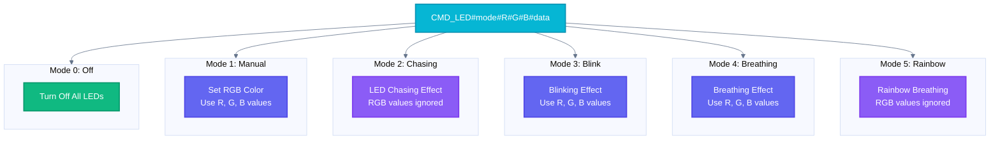
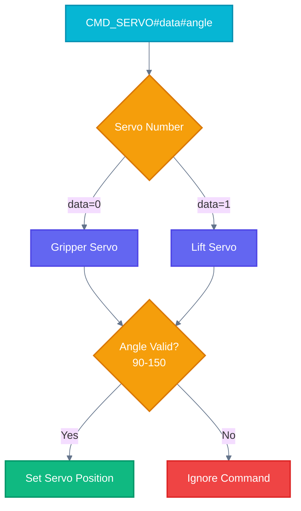
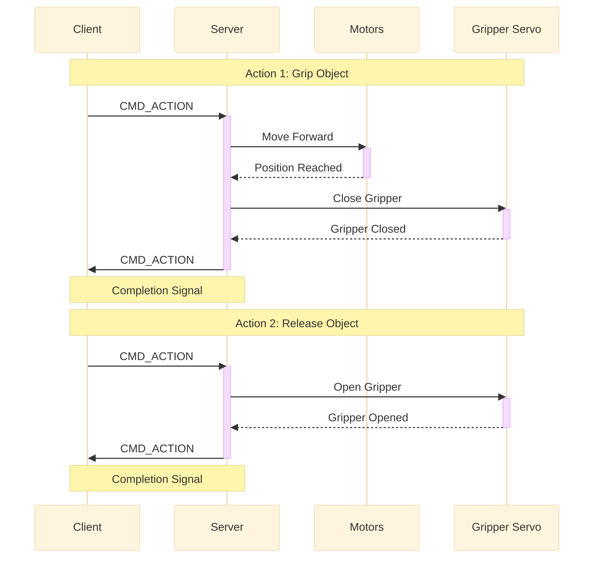
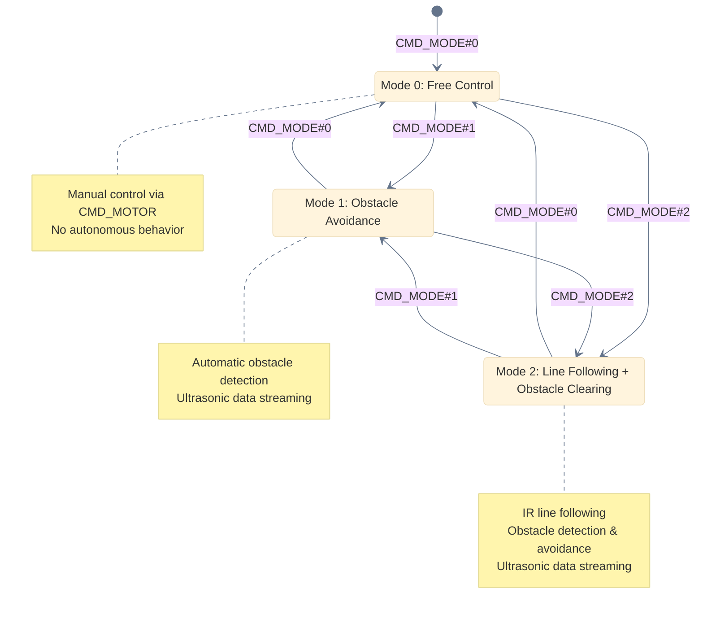

# FNK0077: Freenove Tank Robot Kit for Raspberry Pi

## Supported Communication Method

| Method    | Description                                                      |
|-----------|------------------------------------------------------------------|
| TCPSocket | Port 5003 for command transmission, Port 8003 for video transmission |

## Command Format

Format: `A#10#20#30#40#50#\n`

- Each command starts with a command character (e.g., "A") to indicate the category.
- The `#` symbol acts as a separator between the command character and parameters.
- Each command ends with `\n` to mark its termination.
- During parsing:
  1. Split commands using `\n`.
  2. For each command, split the command character and parameters using `#`.
  3. Any remaining data after splitting should be carried over to the next parsing cycle.
  4. Commands consist of 1 command character and 0 to n parameters, depending on the specific command.

### Command Parsing Flow



## FNK0077 Commands

```
CMD_MOTOR  = "CMD_MOTOR"
CMD_LED    = "CMD_LED"
CMD_SERVO  = "CMD_SERVO"
CMD_ACTION = "CMD_ACTION"
CMD_SONIC  = "CMD_SONIC"
CMD_MODE   = "CMD_MODE"
```

### TCP Communication Architecture



## FNK0077 Communication Protocol

### CMD_MOTOR

Controls the basic movement of the car, value range: -4095 ~ 4095

| App Command              | Action        |
|--------------------------|---------------|
| `CMD_MOTOR#2000#2000\n`  | Move forward  |
| `CMD_MOTOR#-2000#-2000\n`| Move backward |
| `CMD_MOTOR#-2000#2000\n` | Turn left     |
| `CMD_MOTOR#2000#-2000\n` | Turn right    |
| `CMD_MOTOR#0#0\n`        | Stop          |

### CMD_LED

Controls the LED lights.

Format: `CMD_LED#mode#R#G#B#data\n`

- **mode**: LED mode.
- **R, G, B**: Color values.
- **data**: the selection of 4 LEDs, value range: 0-15, 15 means selecting 4 LED lights.

| App Command                | Action                      |
|----------------------------|-----------------------------|
| `CMD_LED#mode#R#G#B#data\n`| Light up with specified color |

#### LED Modes



| App Command                | Action                                  |
|----------------------------|-----------------------------------------|
| `CMD_LED_MOD#0#R#G#B#15\n` | Turn off                                |
| `CMD_LED_MOD#1#R#G#B#15\n` | Manual RGB control                      |
| `CMD_LED_MOD#2#R#G#B#15\n` | Chasing mode (RGB value invalid)        |
| `CMD_LED_MOD#3#R#G#B#15\n` | Blink mode (input RGB)                  |
| `CMD_LED_MOD#4#R#G#B#15\n` | Breathing mode (input RGB)              |
| `CMD_LED_MOD#5#R#G#B#15\n` | Rainbow breathing mode (RGB value invalid) |

### CMD_SERVO

Controls servo angles.

Format: `CMD_SERVO#data#angle`

- **data**: Servo number (0 = gripper servo, 1 = lift servo).
- **angle**: Servo angle (range: 90-150).



| App Command           | Action                          |
|-----------------------|---------------------------------|
| `CMD_SERVO#0#angle\n` | Set gripper servo angle (90-150) |
| `CMD_SERVO#1#angle\n` | Set lift servo angle (90-150)    |

#### Host Control Commands

| Direction | Command              |
|-----------|----------------------|
| Up        | `CMD_SERVO#1#angle+5`|
| Down      | `CMD_SERVO#1#angle-5`|
| Left      | `CMD_SERVO#0#angle-5`|
| Right     | `CMD_SERVO#0#angle+5`|
| Home      | `CMD_SERVO#0#90` + `CMD_SERVO#1#140` |

### CMD_ACTION

Controls object gripping and releasing.



| App Command        | Action                    |
|--------------------|---------------------------|
| `CMD_ACTION#1\n`   | Move forward and grip object |
| `CMD_ACTION#2\n`   | Release gripped object    |

**CMD_ACTION#1**: Move forward and grip the object. After the action is completed, send the following to the host computer (client): `CMD_ACTION#10` (Used to determine whether the action is completed.)

**CMD_ACTION#2**: Release the gripped object. After the action is completed, send the following to the host computer (client): `CMD_ACTION#20` (Used to determine whether the action is completed.)

### CMD_MODE

Sets the car's movement mode.



| App Command      | Action                              |
|------------------|-------------------------------------|
| `CMD_MODE#0\n`   | Free control mode                   |
| `CMD_MODE#1\n`   | Obstacle avoidance mode             |
| `CMD_MODE#2\n`   | Line-following & obstacle-clearing mode |

### CMD_SONIC

Ultrasonic distance measurement.

| App Command        | Action                   |
|--------------------|--------------------------|
| `CMD_SONIC#data\n` | Enable ultrasonic ranging |

In `CMD_MODE#1` and `CMD_MODE#2` modes, the car sends ultrasonic distance data to the host (client).
