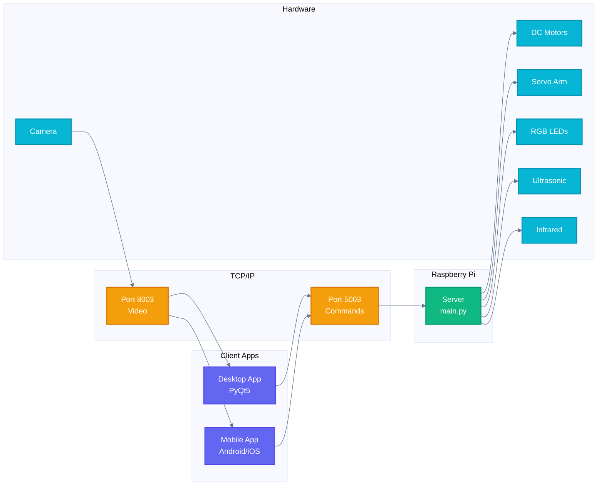
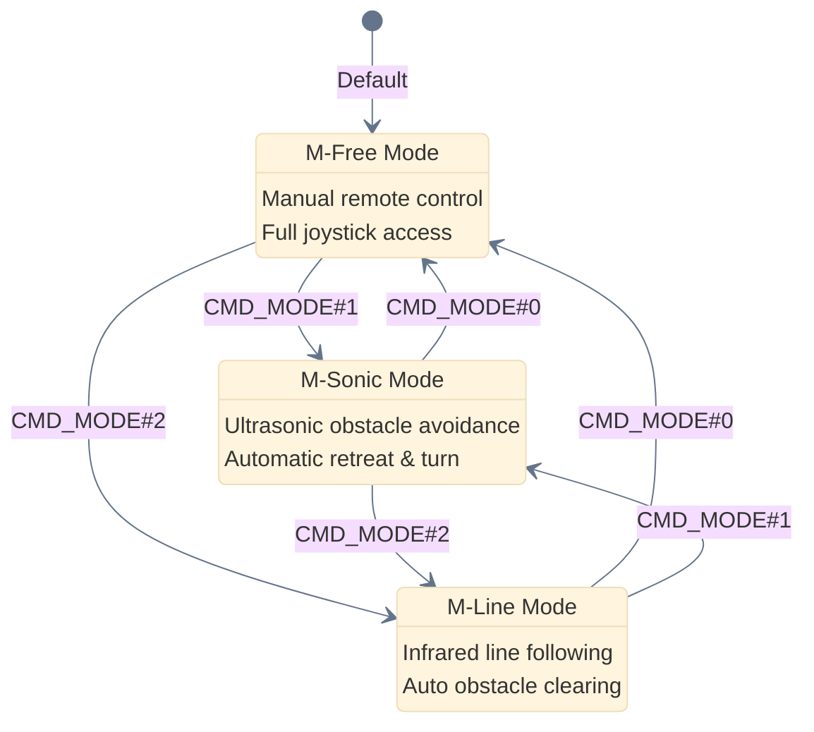

<div align="center">

# Freenove Tank Robot Kit for Raspberry Pi

[](https://creativecommons.org/licenses/by-nc-sa/3.0/)
[](https://www.raspberrypi.org/)
[](https://www.python.org/)
[]()


**A powerful robotics platform with gripper arm, camera streaming, and autonomous modes**

[Tutorial](./Tutorial.md) · [Protocol](./Communication%20Protocol.md) · [Report Bug](mailto:support@freenove.com) · [Request Feature](mailto:support@freenove.com)

</div>

---

## Features

| | Feature | Description |
|:---:|---|---|
| **Remote Control** | Desktop & mobile apps with live video streaming |
| **Gripper Arm** | 2-axis servo arm for picking and placing objects |
| **Obstacle Avoidance** | Ultrasonic sensor for autonomous navigation |
| **Line Following** | 3-channel infrared tracking for path following |
| **RGB LEDs** | 4 programmable WS2812 LEDs with multiple modes |
| **Ball Tracking** | Computer vision for colored ball detection |

---

## Architecture



---

## Quick Start

### 1. Clone the Repository

```bash
git clone --depth 1 https://github.com/Freenove/Freenove_Tank_Robot_Kit_for_Raspberry_Pi.git
cd Freenove_Tank_Robot_Kit_for_Raspberry_Pi
```

### 2. Setup Raspberry Pi

```bash
cd Code
sudo python3 setup.py
```

> Select your camera model when prompted (OV5647 or IMX219)

### 3. Start the Server

```bash
cd Code/Server
python3 main.py
```

### 4. Run the Client

**Windows/macOS/Linux:**
```bash
cd Code/Client
python3 Main.py
```

**Mobile:** Search "Freenove" in App Store or Google Play

---

## Robot Modes



---

## Command Protocol

```mermaid
%%{init: {'theme': 'base', 'themeVariables': {'lineColor': '#64748b'}}}%%
flowchart LR
    classDef cmd fill:#6366f1,stroke:#4f46e5,stroke-width:2px,color:#ffffff
    classDef param fill:#10b981,stroke:#059669,stroke-width:2px,color:#ffffff

    subgraph Format["Command Format"]
        direction TB
        CMD[CMD_NAME]:::cmd
        SEP1[#]
        P1[param1]:::param
        SEP2[#]
        P2[param2]:::param
        TERM[\n]
    end

    CMD --- SEP1 --- P1 --- SEP2 --- P2 --- TERM
```

| Command | Format | Example | Description |
|---------|--------|---------|-------------|
| **Motor** | `CMD_MOTOR#left#right\n` | `CMD_MOTOR#2000#2000\n` | Control wheels (-4095 to 4095) |
| **Servo** | `CMD_SERVO#id#angle\n` | `CMD_SERVO#0#120\n` | Move servo (90-150°) |
| **LED** | `CMD_LED#mode#R#G#B#mask\n` | `CMD_LED#1#255#0#0#15\n` | Set LED color |
| **Mode** | `CMD_MODE#mode\n` | `CMD_MODE#1\n` | Change robot mode |
| **Action** | `CMD_ACTION#id\n` | `CMD_ACTION#1\n` | Execute grip/release |

---

## Hardware Compatibility

<table>
<tr>
<td width="50%">

### PCB V1.0


| Component | GPIO |
|-----------|------|
| Servo 0/1 | 7, 8 |
| Infrared | 16, 20, 21 |
| LED | GPIO18 (WS281X) |

**Best with: Raspberry Pi 4**

</td>
<td width="50%">

### PCB V2.0


| Component | GPIO |
|-----------|------|
| Servo 0/1 | 12, 13 |
| Infrared | 16, 26, 21 |
| LED | GPIO10 (SPI) |

**Best with: Raspberry Pi 5**

</td>
</tr>
</table>

> **Note:** RPi 5 cannot use pigpio or WS281X driver with PCB V1.0

---

## Documentation

| Document | Description |
|----------|-------------|
| [Tutorial.md](./Tutorial.md) | Complete assembly & usage guide with images |
| [Communication Protocol.md](./Communication%20Protocol.md) | TCP command reference |
| [About_Battery.md](./About_Battery.md) | Battery requirements & safety |
| [CLAUDE.md](./CLAUDE.md) | Developer guide for contributors |

---

## Client Controls

### Keyboard Shortcuts

| Key | Action | Key | Action |
|:---:|--------|:---:|--------|
| `W` | Forward | `↑` | Arm Up |
| `S` | Backward | `↓` | Arm Down |
| `A` | Turn Left | `←` | Arm Left |
| `D` | Turn Right | `→` | Arm Right |
| `Space` | Stop | `Home` | Arm Home |
| `Q` | Change Mode | `L` | LED Mode |
| `O` | Grip Object | `P` | Drop Object |
| `C` | Connect | `V` | Video On/Off |

---

## Project Structure

```
Freenove_Tank_Robot_Kit_for_Raspberry_Pi/
├── Code/
│   ├── Server/          # Raspberry Pi server
│   │   ├── main.py      # Entry point
│   │   ├── car.py       # Core logic
│   │   ├── motor.py     # DC motor control
│   │   ├── servo.py     # Servo control
│   │   ├── led.py       # WS2812 LEDs
│   │   ├── camera.py    # Video streaming
│   │   ├── ultrasonic.py
│   │   └── infrared.py
│   └── Client/          # Desktop client
│       ├── Main.py      # Entry point
│       └── Client_Ui.py # PyQt5 UI
├── Tutorial.md          # Full documentation
├── Tutorial_images/     # 331 assembly images
└── Picture/             # Product images
```

---

## Support

<div align="center">

| | |
|:---:|:---:|
| **Technical Support** | [support@freenove.com](mailto:support@freenove.com) |
| **Business Inquiries** | [sale@freenove.com](mailto:sale@freenove.com) |
| **Store** | [store.freenove.com](http://store.freenove.com) |
| **Website** | [www.freenove.com](http://www.freenove.com) |

</div>

---

## License

<div align="center">

This project is licensed under [Creative Commons Attribution-NonCommercial-ShareAlike 3.0](http://creativecommons.org/licenses/by-nc-sa/3.0/)

**Commercial use is NOT permitted**


Freenove brand and logo are copyright of Freenove Creative Technology Co., Ltd.

</div>

---

<div align="center">

**[Freenove](http://www.freenove.com)** - Open Source Electronics Platform

*Making robotics and programming accessible to everyone*

</div>
