# Freenove Tank Robot Kit for Raspberry Pi - Tutorial

> **Product**: FNK0077
> **Support**: support@freenove.com
> **Website**: [www.freenove.com](http://www.freenove.com)

---

## Welcome

Thank you for choosing Freenove products!

### About Battery

First, read the document [About_Battery.md](./About_Battery.md) in this folder.

If you have not downloaded the zip file, please download it and unzip it via link below:
https://github.com/Freenove/Freenove_Tank_Robot_Kit_for_Raspberry_Pi/archive/master.zip

### Get Support and Offer Input

Freenove provides free and responsive product and technical support, including but not limited to:

- Product quality issues
- Product use and build issues
- Questions regarding the technology employed in our products for learning and education
- Your input and opinions are always welcome
- We also encourage your ideas and suggestions for new products and product improvements

For any of the above, you may send us an email to: **support@freenove.com**

### Safety and Precautions

Please follow the following safety precautions when using or storing this product:

- Keep this product out of the reach of children under 6 years old.
- This product should be used only when there is adult supervision present as young children lack necessary judgment regarding safety and the consequences of product misuse.
- This product contains small parts and parts, which are sharp. This product contains electrically conductive parts. Use caution with electrically conductive parts near or around power supplies, batteries and powered (live) circuits.
- When the product is turned ON, activated or tested, some parts will move or rotate. To avoid injuries to hands and fingers, keep them away from any moving parts!
- It is possible that an improperly connected or shorted circuit may cause overheating. Should this happen, immediately disconnect the power supply or remove the batteries and do not touch anything until it cools down! When everything is safe and cool, review the product tutorial to identify the cause.
- Only operate the product in accordance with the instructions and guidelines of this tutorial, otherwise parts may be damaged or you could be injured.
- Store the product in a cool dry place and avoid exposing the product to direct sunlight.
- After use, always turn the power OFF and remove or unplug the batteries before storing.

### About Freenove

Freenove provides open source electronic products and services worldwide.

Freenove is committed to assist customers in their education of robotics, programming and electronic circuits so that they may transform their creative ideas into prototypes and new and innovative products. To this end, our services include but are not limited to:

- Educational and Entertaining Project Kits for Robots, Smart Cars and Drones
- Educational Kits to Learn Robotic Software Systems for Arduino, Raspberry Pi and micro:bit
- Electronic Component Assortments, Electronic Modules and Specialized Tools
- **Product Development and Customization Services**

### Copyright

All the files, materials and instructional guides provided are released under [Creative Commons Attribution-NonCommercial-ShareAlike 3.0 Unported License](https://creativecommons.org/licenses/by-nc-sa/3.0/).

This means you can use these resources in your own derived works, in part or completely, but **NOT for the intent or purpose of commercial use**.

Freenove brand and logo are copyright of Freenove Creative Technology Co., Ltd. and cannot be used without written permission.

Raspberry Pi is a trademark of Raspberry Pi Foundation (https://www.raspberrypi.org/).

---

## Contents

- [Welcome](#welcome)
- [List](#list)
  - [Machinery Parts](#machinery-parts)
  - [Transmission Parts](#transmission-parts)
  - [Acrylic Parts](#acrylic-parts)
  - [Electronic Parts](#electronic-parts)
  - [Tools](#tools)
  - [Self-prepared Parts](#self-prepared-parts)
- [Tank Smart Car Board for Raspberry Pi](#tank-smart-car-board-for-raspberry-pi)
- [Preface](#preface)
- [Raspberry Pi Introduction](#raspberry-pi-introduction)
- [Chapter 0: Raspberry Pi Preparation](#chapter-0-raspberry-pi-preparation)
  - [Install a System](#install-a-system)
  - [Getting Started with Raspberry Pi](#getting-started-with-raspberry-pi)
- [Chapter 1: Software Installation and Test](#chapter-1-software-installation-and-test)
  - [Step 1: Obtain the Code](#step-1-obtain-the-code)
  - [Step 2: Install the Needed Libraries](#step-2-install-the-needed-libraries)
- [Chapter 2: Assemble Smart Car](#chapter-2-assemble-smart-car)
- [Chapter 3: Module Test](#chapter-3-module-test)
- [Chapter 4: Ultrasonic Obstacle Avoidance Car](#chapter-4-ultrasonic-obstacle-avoidance-car)
- [Chapter 5: Infrared Tracking Automatic Wrecker](#chapter-5-infrared-tracking-automatic-wrecker)
- [Chapter 6: Smart Video Car](#chapter-6-smart-video-car)
  - [Server](#server)
  - [Client](#client)
  - [Android and iOS App](#android-and-ios-app)
- [What's Next?](#whats-next)

---

## System Architecture

The Freenove Tank Robot Kit uses a client-server architecture where the Raspberry Pi acts as the server controlling hardware, and a desktop/mobile client sends commands and receives video.

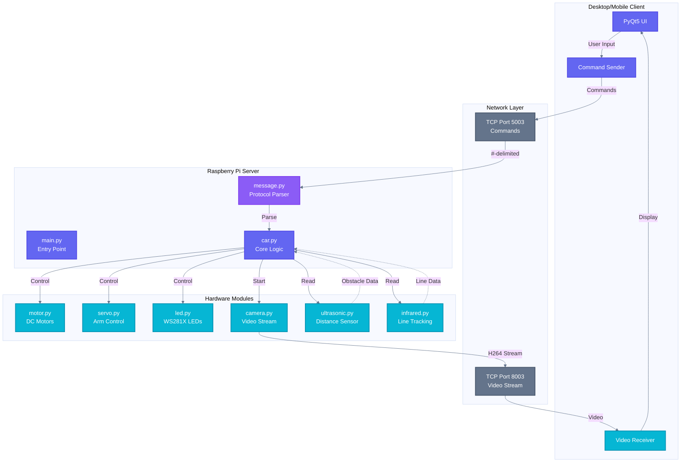
```mermaid
%%{init: {'theme': 'base', 'themeVariables': {'lineColor': '#64748b'}}}%%
flowchart TD
    classDef success fill:#10b981,stroke:#059669,stroke-width:2px,color:#ffffff
    classDef process fill:#6366f1,stroke:#4f46e5,stroke-width:2px,color:#ffffff
    classDef decision fill:#f59e0b,stroke:#d97706,stroke-width:2px,color:#ffffff
    classDef error fill:#ef4444,stroke:#dc2626,stroke-width:2px,color:#ffffff
    classDef info fill:#8b5cf6,stroke:#7c3aed,stroke-width:2px,color:#ffffff
    classDef critical fill:#ec4899,stroke:#db2777,stroke-width:2px,color:#ffffff
    classDef data fill:#06b6d4,stroke:#0891b2,stroke-width:2px,color:#ffffff
    classDef external fill:#64748b,stroke:#475569,stroke-width:2px,color:#ffffff

    subgraph Client["Desktop/Mobile Client"]
        UI[PyQt5 UI]:::process
        CMD[Command Sender]:::process
        VID[Video Receiver]:::data
    end

    subgraph Network["Network Layer"]
        TCP1[TCP Port 5003<br/>Commands]:::external
        TCP2[TCP Port 8003<br/>Video Stream]:::external
    end

    subgraph Server["Raspberry Pi Server"]
        MAIN[main.py<br/>Entry Point]:::process
        CAR[car.py<br/>Core Logic]:::process
        MSG[message.py<br/>Protocol Parser]:::info
    end

    subgraph Hardware["Hardware Modules"]
        MOTOR[motor.py<br/>DC Motors]:::data
        SERVO[servo.py<br/>Arm Control]:::data
        LED[led.py<br/>WS281X LEDs]:::data
        CAM[camera.py<br/>Video Stream]:::data
        SONIC[ultrasonic.py<br/>Distance Sensor]:::data
        IR[infrared.py<br/>Line Tracking]:::data
    end

    UI -->|User Input| CMD
    CMD -->|Commands| TCP1
    TCP1 -->|#-delimited| MSG
    MSG -->|Parse| CAR

    CAR -->|Control| MOTOR
    CAR -->|Control| SERVO
    CAR -->|Control| LED
    CAR -->|Start| CAM
    CAR -->|Read| SONIC
    CAR -->|Read| IR

    CAM -->|H264 Stream| TCP2
    TCP2 -->|Video| VID
    VID -->|Display| UI

    SONIC -.->|Obstacle Data| CAR
    IR -.->|Line Data| CAR
```

As shown in the diagram above, the client application communicates with the Raspberry Pi server over TCP. Commands flow through port 5003 using a text-based protocol with `#` delimiters, while video streams back through port 8003. The server's `car.py` module orchestrates all hardware interactions.

---

## List

If you have any concerns, please feel free to contact us via support@freenove.com

### Machinery Parts

| Part | Quantity |
|------|----------|
| M3*24 Brass Standoff | x5 |
| M3*10 Brass Standoff | x3 |
| M2.5*11 Brass Standoff | x5 |
| M2.5*6+6 Screw | x5 |
| M4*10 Rivet | x9 |
| M3*12 Screw | x13 |
| M3*8 Screw | x18 |
| M2.5*7 Screw | x9 |
| M3*10 Countersunk Head Screw | x6 |
| M1.4*5 Screw | x12 |
| M2*20 Screw | x10 |
| M4*50 Half Tooth Screw | x2 |
| M4 Screw | x5 |
| M3 Nut | x19 |
| M2 Nut | x10 |


*Machinery parts included in the kit*

### Transmission Parts

| Part | Quantity |
|------|----------|
| Track drive wheels | x2 |
| Track follower wheels | x2 |
| Servo package | x2 |
| Track | x2 |
| DC speed reduction motor | x2 |
| Motor bracket bag | x2 |

> **Warning**: Do NOT remove the cable tie on the motor!

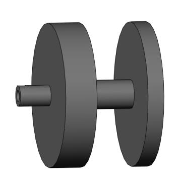
*Transmission parts: wheels, motors, servos, and tracks*

### Acrylic Parts

The kit includes laser-cut acrylic parts that form the chassis and body of the tank robot.

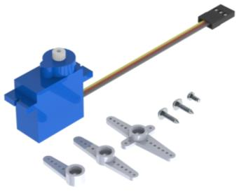
*Acrylic chassis and body parts*

### Electronic Parts

| Part | Quantity |
|------|----------|
| Line tracking module | x1 |
| Camera (OV5647 or IMX219) | x1 |
| HC-SR04 Ultrasonic Module | x1 |
| Jumper Wire F/F (4-pin) | x1 |
| XH-2.54-5Pin cable | x1 |
| FPC cable | x1 |


*Electronic components: sensors, camera, and cables*

### Tools

| Tool | Quantity |
|------|----------|
| Cross screwdriver (3mm) | x1 |
| Cross screwdriver (2mm) | x1 |
| Black tape | x1 |
| Cable Tidy | x20cm |
| Red ball | x1 |
| Aluminum alloy coupling | x2 |
| Internal hexagonal wrench | x1 |

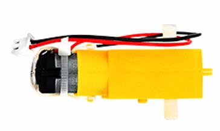
*Tools included in the kit*

### Self-prepared Parts

**You need to prepare these items yourself:**

1. **2x 3.7V 18650 lithium rechargeable batteries** with continuous discharge current >3A
   - It is easier to find proper battery on eBay than Amazon
   - Search "18650 high drain" on eBay

2. **Raspberry Pi** (Recommended model: Raspberry Pi 5 / 4B / 3B+) x1


*18650 batteries and supported Raspberry Pi models*

---

## Tank Smart Car Board for Raspberry Pi

> **Note**: The images of the car board may look different from the one you receive (V1.0 or V2.0). The interface design of the two versions is the same, so the operations are identical. You can just follow this book to use it.

| Tank Smart Car Board V1.0 | Tank Smart Car Board V2.0 |
|---------------------------|---------------------------|
| 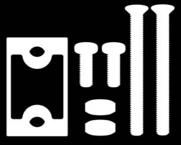 | 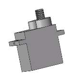 |

---

## Preface

Welcome to use Freenove Tank Kit for Raspberry Pi. Following this tutorial, you can make a very cool smart car with many functions.

This kit is based on Raspberry Pi, a popular control panel, so you can share and exchange your experience and design ideas with many enthusiasts all over the world. The parts in this kit include all electronic components, modules, and mechanical components required for making the smart car. And all of them are packaged individually. There are detailed assembly and commissioning instructions in this book.

And if you encounter any problems, please feel free to contact us for fast and free technical support: **support@freenove.com**

The contents in this book can help enthusiasts with little technical knowledge to make a smart car. If you are very interested in Raspberry Pi, and want to learn how to program and build the circuit, please visit our website www.freenove.com or contact us to buy the kits designed for beginners:
- Freenove Basic Starter Kit for Raspberry Pi
- Freenove LCD1602 Starter Kit for Raspberry Pi
- Freenove Super Starter Kit for Raspberry Pi
- Freenove Ultrasonic Starter Kit for Raspberry Pi
- Freenove RFID Starter Kit for Raspberry Pi
- Freenove Ultimate Starter Kit for Raspberry Pi

---

## Raspberry Pi Introduction

Raspberry Pi (called RPi, RPI, RasPi - these words will be used alternately later), a micro-computer with size of a card, quickly swept the world since its debut. It is widely used in desktop workstation, media center, smart home, robots, and even servers, etc. It can do almost anything, which continues to attract fans to explore it.

Raspberry Pi used to run with Linux system and along with the release of Windows 10 IoT, we can also run it with Windows. Raspberry Pi (with interfaces USB, network, HDMI, camera, audio, display and GPIO), as a microcomputer, can run in command line mode and desktop system mode. Additionally, it is easy to operate just like Arduino, and you can even directly operate the GPIO of CPU.

So far, Raspberry Pi has advanced to its fifth generation product offering. Version changes are accompanied by increases in upgrades in hardware and capabilities.

The A type and B type versions of the first generation products have been discontinued due to various reasons. What is most important is that other popular and currently available versions are consistent in the order and number of pins and their assigned designation of function, making compatibility of peripheral devices greatly enhanced between versions.

### Supported Raspberry Pi Models

All models below have 40 GPIO pins and are supported:

| Model | Physical Image | CAD Image |
|-------|---------------|-----------|
| Raspberry Pi 5 | 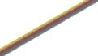 |  |
| Raspberry Pi 4 Model B | 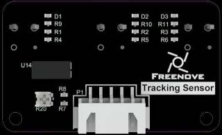 | 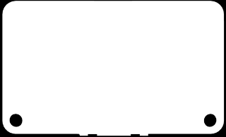 |
| Raspberry Pi 3 Model B+ |  | 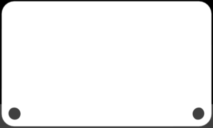 |
| Raspberry Pi 3 Model B | 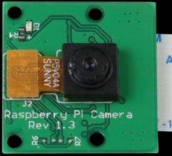 | 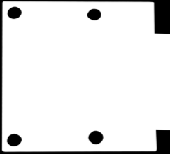 |
| Raspberry Pi 2 Model B |  | 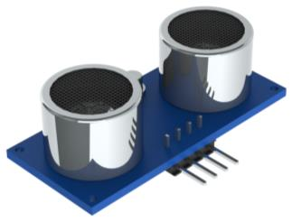 |
| Raspberry Pi 1 Model B+ |  | 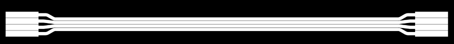 |
| Raspberry Pi 3 Model A+ | 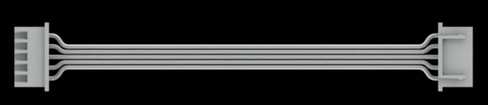 |  |
| Raspberry Pi 1 Model A+ | 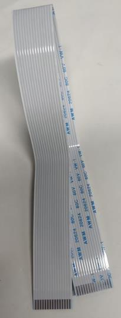 | 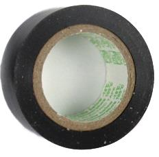 |
| Raspberry Pi Zero W | 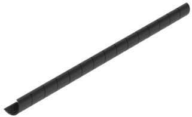 |  |
| Raspberry Pi Zero | 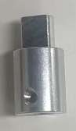 | 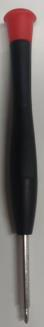 |

### Hardware Interface Diagrams

#### Raspberry Pi 5

```
┌─────────────────────────────────────────────────────────────┐
│  GPIO Connector (40 pins)                          USB x4  │
│  ○○○○○○○○○○○○○○○○○○○○                              ┌──┐┌──┐│
│  ○○○○○○○○○○○○○○○○○○○○                              │  ││  ││
│                                                    └──┘└──┘│
│  PCI Express    ┌────┐                             ┌──┐┌──┐│
│  Interface      │    │                             │  ││  ││
│                 └────┘                             └──┘└──┘│
│  On/Off ○                                                  │
│                                                   Ethernet │
│  Power ═══                                          ┌────┐ │
│  (USB-C)    ┌────┐  ┌────┐  ┌──────┐  ┌──────────┐ │    │ │
│             │HDMI│  │HDMI│  │Camera│  │ Display  │ └────┘ │
│             │ 0  │  │ 1  │  │      │  │          │        │
└─────────────┴────┴──┴────┴──┴──────┴──┴──────────┴────────┘
```

#### Raspberry Pi 4B

```
┌─────────────────────────────────────────────────────────────┐
│  GPIO Connector (40 pins)                         Ethernet │
│  ○○○○○○○○○○○○○○○○○○○○                              ┌────┐  │
│  ○○○○○○○○○○○○○○○○○○○○                              │    │  │
│                                                    └────┘  │
│  ┌──────────┐                                      USB x4  │
│  │ Display  │                                     ┌──┐┌──┐ │
│  │          │                                     │  ││  │ │
│  └──────────┘                                     └──┘└──┘ │
│                         ┌────┐   Audio            ┌──┐┌──┐ │
│  Power ═══             │Cam │   ○○○○             │  ││  │ │
│  (USB-C)   ┌────┐┌────┐└────┘                    └──┘└──┘ │
│            │HDMI││HDMI│                                    │
│            │ 0  ││ 1  │                                    │
└────────────┴────┴┴────┴────────────────────────────────────┘
```

### GPIO (General Purpose Input/Output)

GPIO: General purpose input/output. We will introduce the specific feature of the pins on the Raspberry Pi and what you can do with them. You can use them for all sorts of purposes. Most of them can be used as either inputs or outputs, depending on your program.

When programming the GPIO pins there are 3 different ways to refer to them:
1. GPIO numbering (BCM)
2. Physical numbering
3. WiringPi GPIO Numbering

#### Physical Numbering

Another way to refer to the pins is by simply counting across and down from pin 1 at the top left (nearest to the SD card). This is 'physical numbering':

```
        Pin 1                              Pin 2
         3.3V  ●  ●  5V
   GPIO2/SDA1  ●  ●  5V
   GPIO3/SCL1  ●  ●  GND
        GPIO4  ●  ●  GPIO14/TXD0
          GND  ●  ●  GPIO15/RXD0
       GPIO17  ●  ●  GPIO18
       GPIO27  ●  ●  GND
       GPIO22  ●  ●  GPIO23
         3.3V  ●  ●  GPIO24
  GPIO10/MOSI  ●  ●  GND
   GPIO9/MISO  ●  ●  GPIO25
  GPIO11/SCLK  ●  ●  GPIO8/CE0#
          GND  ●  ●  GPIO7/CE1#
   GPIO0/ID_SD ●  ●  GPIO1/ID_SC
        GPIO5  ●  ●  GND
        GPIO6  ●  ●  GPIO12
       GPIO13  ●  ●  GND
  GPIO19/MISO  ●  ●  GPIO16/CE2#
       GPIO26  ●  ●  GPIO20/MOSI
          GND  ●  ●  GPIO21/SCLK
        Pin 39                             Pin 40
```

**Legend:**
- Yellow: GPIO
- Black: Ground
- Orange: 3.3V
- Red: 5V
- White: ID EEPROM (Advanced use only)

For more details about pin definition of GPIO, please refer to http://pinout.xyz/

---

## Chapter 0: Raspberry Pi Preparation

### Setup Workflow

The setup process involves preparing your Raspberry Pi, installing the OS, configuring network access, and installing required libraries for the tank robot.


```mermaid
%%{init: {'theme': 'base', 'themeVariables': {'lineColor': '#64748b'}}}%%
flowchart TD
    classDef success fill:#10b981,stroke:#059669,stroke-width:2px,color:#ffffff
    classDef process fill:#6366f1,stroke:#4f46e5,stroke-width:2px,color:#ffffff
    classDef decision fill:#f59e0b,stroke:#d97706,stroke-width:2px,color:#ffffff
    classDef error fill:#ef4444,stroke:#dc2626,stroke-width:2px,color:#ffffff
    classDef info fill:#8b5cf6,stroke:#7c3aed,stroke-width:2px,color:#ffffff
    classDef critical fill:#ec4899,stroke:#db2777,stroke-width:2px,color:#ffffff
    classDef data fill:#06b6d4,stroke:#0891b2,stroke-width:2px,color:#ffffff
    classDef external fill:#64748b,stroke:#475569,stroke-width:2px,color:#ffffff

    START([Start Setup]):::success
    PREPARE[Prepare Components:<br/>RPi, SD Card, Power, Reader]:::process
    DOWNLOAD[Download Raspberry Pi Imager]:::process
    FLASH[Flash OS to SD Card]:::process
    CONFIG[Configure SSH & WiFi]:::info
    INSERT[Insert SD Card into RPi]:::process
    BOOT[Power On & Boot]:::process

    CONNECT{Access<br/>Method?}:::decision
    MONITOR[Connect Monitor,<br/>Keyboard, Mouse]:::process
    SSH[SSH via Terminal:<br/>ssh pi@raspberrypi.local]:::process
    VNC[Enable VNC via<br/>raspi-config]:::info
    VNCVIEW[Connect with<br/>VNC Viewer]:::process

    DESKTOP[Access Desktop]:::success
    CLONE[Clone Repository:<br/>git clone]:::process
    CHMOD[Set Permissions:<br/>chmod 755]:::process
    SETUP[Run setup.py]:::process

    CAMERA{Camera<br/>Type?}:::decision
    OV5647[Select OV5647]:::info
    IMX219[Select IMX219]:::info

    RPI5{Is RPi 5?}:::decision
    CAM0[Select cam0]:::info
    CAM1[Select cam1]:::info
    SKIP[Continue]:::info

    REBOOT[Reboot System]:::process
    COMPLETE([Setup Complete]):::success

    FAIL[Installation Failed:<br/>Check Network]:::error
    RETRY[Rerun setup.py]:::critical

    START --> PREPARE
    PREPARE --> DOWNLOAD
    DOWNLOAD --> FLASH
    FLASH --> CONFIG
    CONFIG --> INSERT
    INSERT --> BOOT
    BOOT --> CONNECT

    CONNECT -->|Monitor| MONITOR
    CONNECT -->|Remote| SSH
    MONITOR --> DESKTOP
    SSH --> VNC
    VNC --> VNCVIEW
    VNCVIEW --> DESKTOP

    DESKTOP --> CLONE
    CLONE --> CHMOD
    CHMOD --> SETUP
    SETUP --> CAMERA

    CAMERA -->|OV5647| OV5647
    CAMERA -->|IMX219| IMX219
    OV5647 --> RPI5
    IMX219 --> RPI5

    RPI5 -->|Yes| CAM0
    RPI5 -->|Yes| CAM1
    RPI5 -->|No| SKIP
    CAM0 --> REBOOT
    CAM1 --> REBOOT
    SKIP --> REBOOT

    REBOOT -->|Success| COMPLETE
    REBOOT -->|Failed| FAIL
    FAIL --> RETRY
    RETRY --> SETUP
```

As shown in the flowchart above, the setup process branches based on your access method (monitor vs remote) and your Raspberry Pi version. The critical steps are OS installation, network configuration, and running the automated setup script which installs all required libraries.

### Install a System

Firstly, install a system for your RPi.

#### Component List

**Required Components:**

| Component | Description |
|-----------|-------------|
| Raspberry Pi 5 / 4B / 3B+ / 3B / 3A+ | Recommended models |
| 5V/3A Power Adapter | Different versions have different power requirements |
| Micro USB Cable | For power (or USB-C for RPi 4/5) |
| Micro SD Card (TF Card) | Minimum 8GB recommended |
| Card Reader | For flashing the OS |

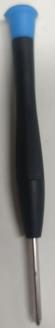
*Required components for Raspberry Pi setup*

#### Additional Accessories for Other Models

| Raspberry Pi Model | Additional Accessories Needed |
|--------------------|-------------------------------|
| Raspberry Pi Zero W | Camera cable (>25cm) for Zero W, 15 Pin 1.0mm Pitch to 22 Pin 0.5mm |
| Raspberry Pi Zero 1.3 | Wireless network adapter, Camera cable, OTG cable (USB Type micro B to USB Type A) |
| Raspberry Pi 2 Model B | Wireless network adapter |
| Raspberry Pi 1 Model A+ | Wireless network adapter |
| Raspberry Pi 1 Model B+ | Wireless network adapter |

#### Power Requirements

| Product | Recommended PSU | Max USB Current | Typical Consumption |
|---------|-----------------|-----------------|---------------------|
| Raspberry Pi 1 Model A | 700mA | 500mA | 200mA |
| Raspberry Pi 1 Model B | 1.2A | 500mA | 500mA |
| Raspberry Pi 1 Model A+ | 700mA | 500mA | 180mA |
| Raspberry Pi 1 Model B+ | 1.8A | 1.2A | 330mA |
| Raspberry Pi 2 Model B | 1.8A | 1.2A | 350mA |
| Raspberry Pi 3 Model B | 2.5A | 1.2A | 400mA |
| Raspberry Pi 3 Model A+ | 2.5A | Limited | 350mA |
| Raspberry Pi 3 Model B+ | 2.5A | 1.2A | 500mA |
| Raspberry Pi 4 Model B | 3.0A | 1.2A | 600mA |
| Raspberry Pi 5 | 5.0A | 1.6A (600mA with 3A PSU) | 800mA |
| Raspberry Pi Zero | 1.2A | Limited | 100mA |
| Raspberry Pi Zero W | 1.2A | Limited | 150mA |
| Raspberry Pi Zero 2 W | 2A | Limited | 350mA |

> **Note**: The Raspberry Pi 5 provides 1.6A of power to downstream USB peripherals when connected to a power supply capable of 5A at +5V (25W). When connected to any other compatible power supply, the RPi 5 restricts downstream USB devices to 600mA of power.

For more details, please refer to https://www.raspberrypi.org/help/faqs/#powerReqs

### Raspberry Pi OS

**Video Tutorials:**
- Headless Installation on Windows: https://youtu.be/XpiT_ezb_7c
- Headless Installation on macOS: https://youtu.be/I1zRHp3Deeg

#### Automatic Method

You can follow the official method to install the system:
https://projects.raspberrypi.org/en/projects/raspberry-pi-setting-up/2

The system will be downloaded automatically via the application.

#### Manual Method

1. Download Raspberry Pi Imager from: https://www.raspberrypi.org/downloads/
2. Download the OS image manually from the same page

#### Write System to Micro SD Card

1. Put your Micro SD card into card reader and connect it to USB port of PC
2. Open Raspberry Pi Imager
3. Click **CHOOSE DEVICE** and select your Raspberry Pi version
4. Click **CHOOSE OS** and select your downloaded image (or use "Use custom")
5. Click **CHOOSE STORAGE** and select your SD card
6. Click **NEXT**

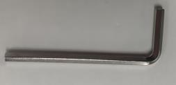
*Raspberry Pi Imager interface*

#### Enable SSH and Configure WiFi

When prompted "Would you like to apply OS customisation settings?", click **EDIT SETTINGS**:

**GENERAL Tab:**
- Set hostname: `raspberrypi`
- Set username and password: `pi` / `raspberry` (or your choice)
- Configure wireless LAN: Enter your WiFi name and password
- Set locale settings: Select your timezone and keyboard layout

**SERVICES Tab:**
- Enable SSH
- Use password authentication

Click **SAVE**, then **YES** to apply settings and write the image.

#### Insert SD Card

1. Remove SD card from card reader
2. Insert it into Raspberry Pi SD card slot
3. Connect power supply and wait for RPi to boot

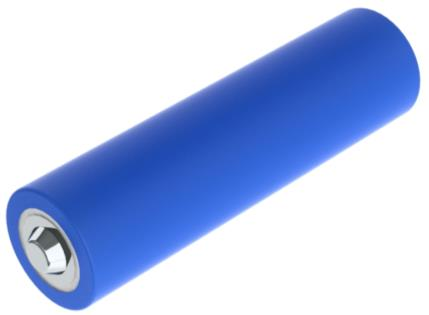
*Insert SD card into Raspberry Pi*

### Getting Started with Raspberry Pi

#### Monitor Desktop

If you have a spare monitor:

1. Insert Micro SD Card into RPi
2. Connect RPi to monitor via HDMI
3. Attach mouse and keyboard via USB
4. Connect network cable (optional)
5. Connect power supply

**Default credentials:**
- Username: `pi`
- Password: `raspberry`

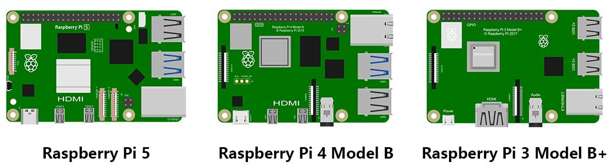
*Raspberry Pi OS desktop after successful login*

Raspberry Pi 5/4B/3B+/3B integrates Wi-Fi. Click the Wi-Fi icon in the top-right corner to connect.

#### Remote Desktop & VNC

If you don't have a spare monitor, you can use SSH and VNC.

##### macOS Remote Desktop

Open Terminal and type:

```bash
ssh pi@raspberrypi.local
```

Or use the IP address:

```bash
ssh pi@192.168.1.95  # Replace with your RPi's IP
```

Default password: `raspberry` (case sensitive)

##### Windows Remote Desktop

1. Press `Win+R`, enter `cmd`
2. Find RPi IP: `ping -4 raspberrypi.local`
3. Connect via SSH: `ssh pi@192.168.1.95`

##### Enable VNC

After connecting via SSH:

```bash
sudo raspi-config
```

Navigate to: **Interface Options** → **VNC** → **Yes** → **OK**

##### VNC Viewer Setup

1. Download VNC Viewer: https://www.realvnc.com/en/connect/download/viewer/
2. Open VNC Viewer
3. Click **File** → **New Connection**
4. Enter RPi IP address and a name
5. Click **OK**
6. Double-click the connection
7. Enter username: `pi`, password: `raspberry`


*VNC Viewer connection setup*

You can adjust scaling in VNC Viewer: Right-click → **Properties** → **Options** → **Scaling**

---

## Chapter 1: Software Installation and Test (necessary)

**Video Tutorial**: https://youtu.be/T7gFezHcqZU

> **Notes:**
> 1. Please use Raspberry Pi OS with Desktop
> 2. The installation of libraries takes much time. You can power Raspberry Pi with a power supply Cable.
> 3. If you are using remote desktop to login Raspberry Pi, you need to use VNC viewer.

### Step 1: Obtain the Code

To download the code, power Raspberry Pi with a power supply cable or switch on S1 (Power Switch). Then open the terminal by clicking the terminal icon or pressing `CTRL + ALT + T`.

```bash
cd ~
git clone --depth 1 https://github.com/Freenove/Freenove_Tank_Robot_Kit_for_Raspberry_Pi.git
```


*Opening terminal and cloning the repository*

Downloading takes some time. Please wait with patience.

You can also find and download the code by visiting:
- Official website: http://www.freenove.com
- GitHub: https://github.com/freenove

If you have never learned Python before, you can learn basics at: https://python.swaroopch.com/basics.html

### Step 2: Install the Needed Libraries

We have written a Python script to install all dependency libraries automatically.

1. **Change permissions:**
```bash
sudo chmod 755 -R ~/Freenove_Tank_Robot_Kit_for_Raspberry_Pi
```

2. **Enter the Code directory:**
```bash
cd ~/Freenove_Tank_Robot_Kit_for_Raspberry_Pi/Code
```

3. **Run setup.py:**
```bash
sudo python setup.py
```

#### Camera Type Selection

The script will ask you to input the camera type. The kit includes **OV5647** camera.

| OV5647 | IMX219 |
|--------|--------|
| 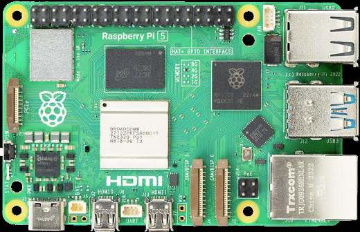 | 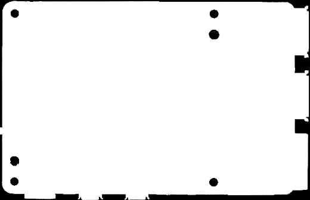 |

#### Raspberry Pi 5 Camera Port

If your RPi is a Pi 5, it will ask which camera interface to use: `cam0` or `cam1`.

> **Important**: Make sure you connect the camera cable to the corresponding interface!

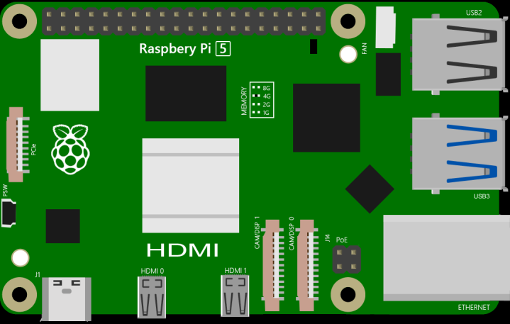
*Raspberry Pi 5 camera ports: Cam0 and Cam1*

4. **Reboot after installation:**
```bash
sudo reboot
```

> **Note**: The reboot takes some time, please wait with patience. If installation fails, please rerun `sudo python setup.py`. Most failures are caused by network issues.

---

## Chapter 2: Assemble Smart Car

**Video Tutorial**: https://youtu.be/44PiaImoPNo

### Step 1: Install Line Tracking Sensor

Secure the line tracking sensor to the acrylic using:
- 2x M3x12 screws
- 2x M3 nuts

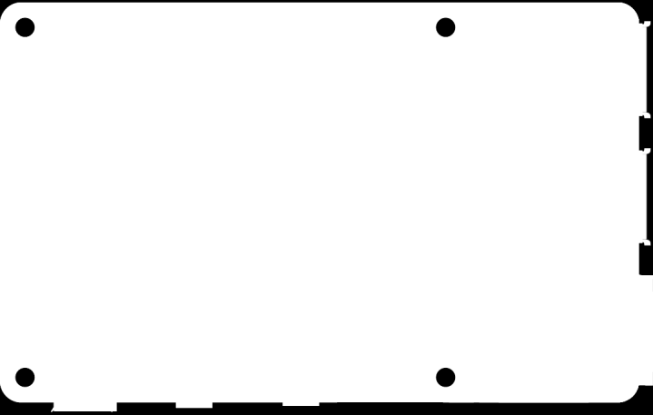
*Line tracking sensor installation*

### Step 2: Attach Acrylic Support Frames

Attach four acrylic support frames using:
- 4x M3x12 screws
- 4x M3 nuts

> **Note**: Pay attention to the position of the round holes in the acrylic support frame.

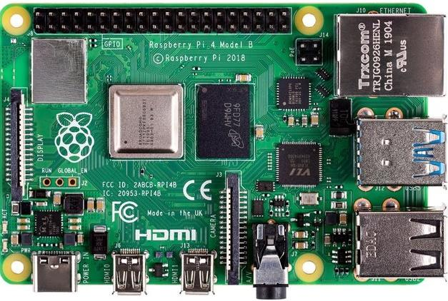
*Acrylic support frame installation*

### Step 3: Assemble Drive Wheels

Using a Half Tooth Screw M4x50 and an M4 nut, assemble the drive wheel.

> Repeat for the other drive wheel.

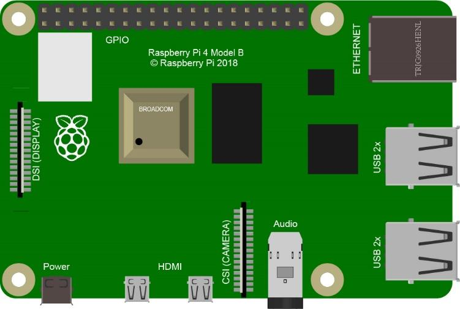
*Drive wheel assembly*

### Step 4: Secure Drive Wheels

Secure the driving wheel to the acrylic support frame using 2x M4 nuts.

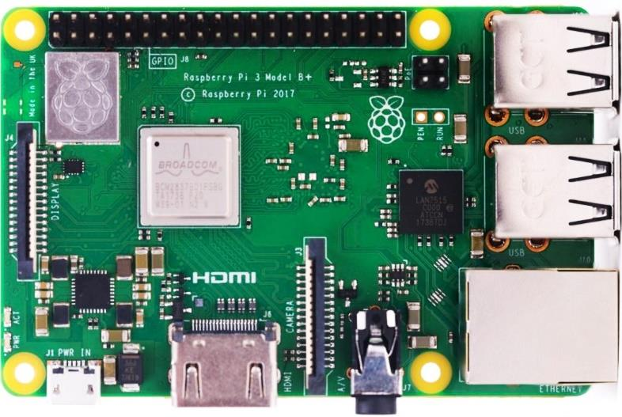
*Drive wheel secured to frame*

### Step 5: Motor Bracket Assembly

The motor bracket bag contains:
- Aluminum bracket
- 2x M3x30 screws
- 2x M3x8 screws
- 2x M3 nuts

Use 2x M3x30 screws and 2x M3 nuts.

> **Warning**: Do NOT remove the cable tie on the motor!

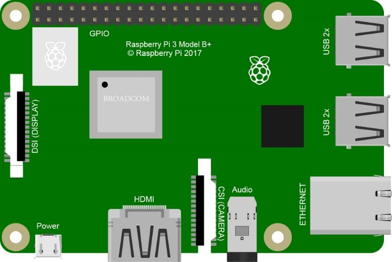
*Motor bracket assembly*

### Step 6: Connect Coupling with Motor

Use an M3x8 screw to connect coupling (bore 6mm) with motor.

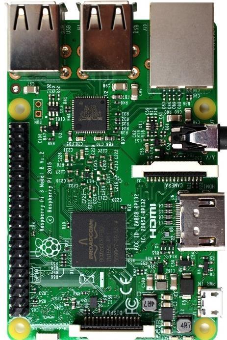
*Coupling connected to motor*

### Step 7: Attach Track Driver

Attach the track driver to the motor using an M3x8 screw.


*Track driver attached to motor*

### Step 8: Install Track

Put the track on as shown. Use two M3x8 screws from the motor bracket bag at the bottom to hold the motor in place.

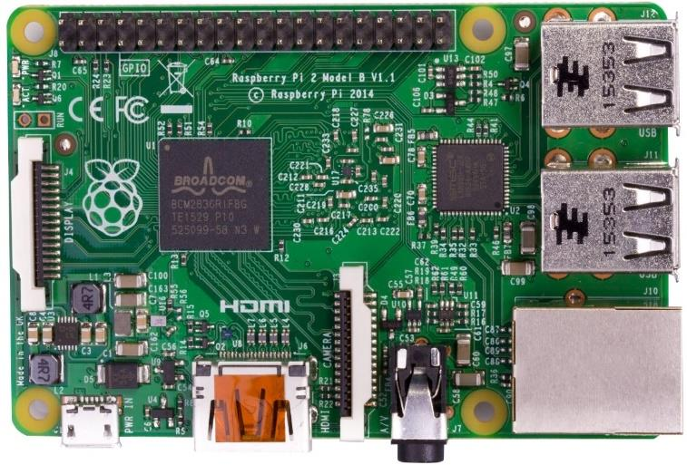
*Track installation*

### Step 9: Install Second Motor and Track

Repeat the same steps to install the motor and track on the other side.

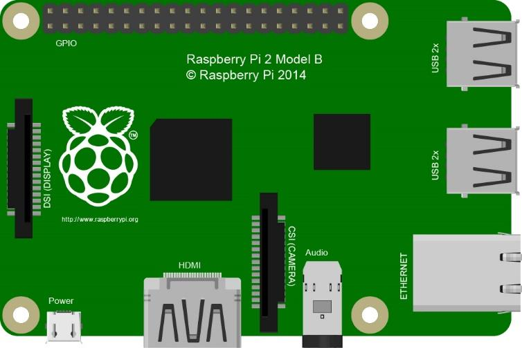
*Both tracks installed*

### Step 10: Attach Camera and Ultrasonic

Attach the camera and ultrasound to the acrylic using 8x M1.4x5 screws.

> **Tip**: If they cannot be installed, flip the acrylic board. The hole sizes are different on two sides.

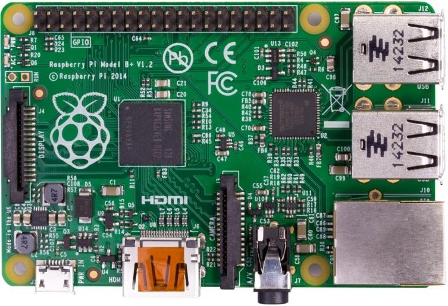
*Camera and ultrasonic sensor mounted*

### Step 11: Mount Camera/Ultrasonic Assembly

Mount onto the acrylic using:
- 1x M3x12 screw
- 1x M3 nut

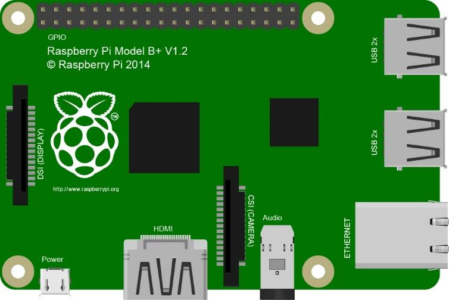
*Camera assembly mounted*

### Step 12: Install Standoffs

Use 4x M3x8 screws to fix 4x M3x24 standoffs onto the acrylic.

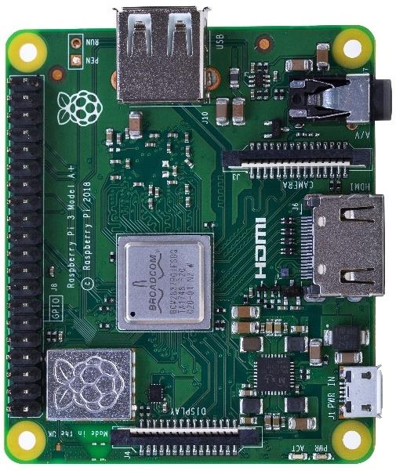
*Standoffs installed*

### Step 13: Battery Case Installation

Use 4x M3x10 screws and 4x M3 nuts to secure the battery case to the acrylic.

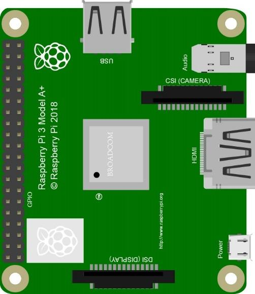
*Battery case secured*

### Step 14: Install M2.5 Standoffs

Attach 4x M2.5x6+6 standoffs using 4x M2.5x7 screws.

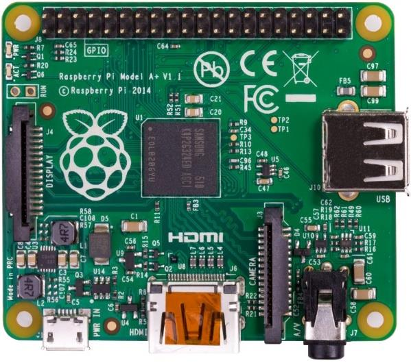
*M2.5 standoffs installed*

### Step 15: Attach Acrylic Connectors

Using 2x M3x12 screws and 2x M3 nuts, secure the two acrylic connectors.

> **Note**: The shape of the acrylic pieces is different, and their positions are fixed.


*Acrylic connectors attached*

### Step 16: Install Rivets

Attach M4x10 Rivets to the acrylic as shown.

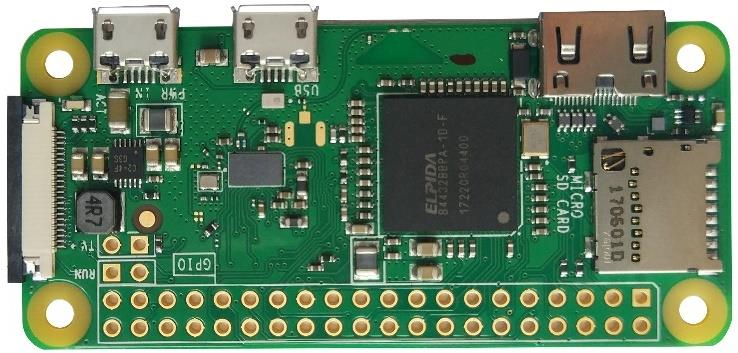
*Rivets installed*

### Step 17: Install Servo (Opaque Black)

Using 2x M2x20 screws and 2x M2 nuts, attach the Opaque Black Servo and 2 acrylics to the bottom acrylic.

> **Important**: Servo shaft is below.

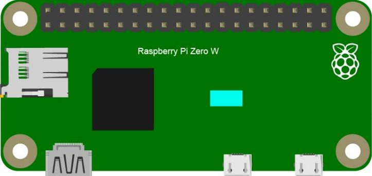
*Servo installed*

### Step 18: Install Raspberry Pi

Place the Raspberry Pi onto the standoffs.

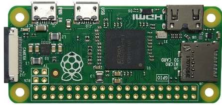
*Raspberry Pi installed*

### Step 19: Install M2.5x11 Standoffs

Install 4x M2.5x11 standoffs onto the Raspberry Pi.

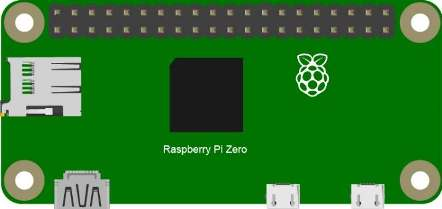
*Standoffs on Raspberry Pi*

### Step 20: Connect Camera

> **Warning**: The CSI camera must be connected or disconnected when powered OFF, or the camera may be burned!

The board is attached to the Raspberry Pi using 4x M3x8 screws.

**Pay attention to the Blue bar of the cable:**

| Correct | Incorrect |
|---------|-----------|
|  |  |

**For Pi 5 users**: Connect the camera to the interface you selected during library installation (cam0 or cam1).

### Step 21: Connect Upper and Lower Acrylic

Install together using 4x M3x8 screws.

> **Note**: The car board may be V1.0 or V2.0. The interface design is the same, so operations are identical.


*Upper and lower acrylic connected*

### Step 22: Install Batteries

Install batteries according to the battery box instructions. Turn on the switch of battery holder.

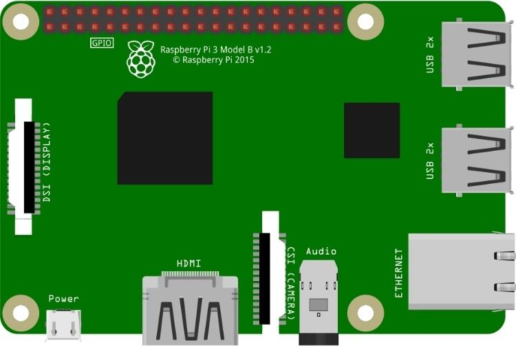
*Batteries installed and switch turned on*

### Step 23: Complete Wiring

Connect all wires to the board.

**Servo wiring varies by board version:**

#### Board V1.0:
- Servo 0 → Port 7
- Servo 1 → Port 8

#### Board V2.0:
- Servo 0 → Port 12
- Servo 1 → Port 13

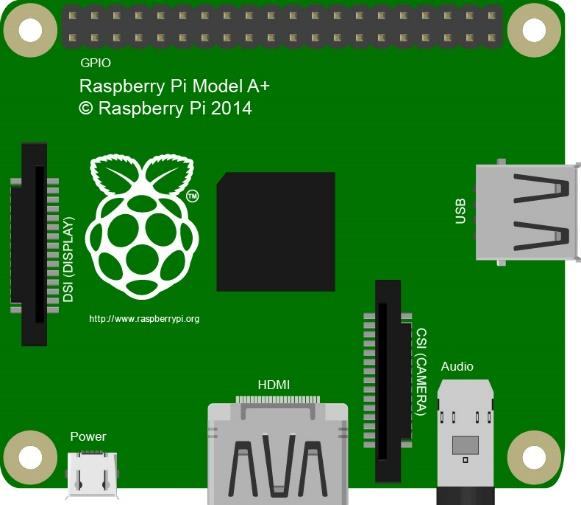
*Complete wiring diagram*

### Step 24: Rotate Servos to 90°

Turn on both switches (S1 and S2).

> **Important**: Before assembling the servos, perform the following steps to adjust them to appropriate angles; otherwise it will affect the final effect.

1. Enter the Server directory:
```bash
cd ~/Freenove_Tank_Robot_Kit_for_Raspberry_Pi/Code/Server/
```

2. Run the servo script:
```bash
sudo python servo.py
```

> **Note for PCB V1.0 users** (non-Pi5): Run `sudo pigpiod` before running servo.py.
> To end the pigpio process: `sudo killall pigpiod`

**Result**: The two servos will spin to the designated angles. If already at that position, nothing will be observed.

> **Important**: Keep the program running during the servo assembly process to avoid assembly offset.


*Switches turned on for servo calibration*

### Step 26: Install Servo Horn

Install using the screws from the Servo package.

> **Important**: Install only after Servo has been rotated to the specified angle.


*Servo horn installation using screws from servo package*

### Step 27: Mount Acrylic Lever

Mount the acrylic lever to the trolley using 2x M4x10 rivets.


*Acrylic lever mounted with M4x10 rivets*

### Step 28: Install Acrylic Connectors

Using 2x M3x12 screws and 2x M3 nuts, install the acrylic as shown.


*Acrylic connectors installed*

### Step 29: Install Rivets

Install using 4x M4x10 rivets.


*Rivets installed on arm structure*

### Step 30: Mount Arm Structure

Install the structure from the previous step on the trolley. Note the direction of the structure.


*Arm structure mounted on trolley*

### Step 31: Install Clear Black Servo

Install the clear black servo to the trolley using 2x M2x20 screws and 2x M2 nuts.

> **Note**: The Servo axis of rotation is on the left.


*Clear black servo installed*

### Step 32: Secure Acrylics Together

Using 2x M2x20 screws and 2x M2 nuts, secure the three acrylics together. At the same time, install using the steering wheel and screws from the Servo package.


*Three acrylics secured together*

### Step 33: Install Servo to Arm

Install using the screws from the Servo package.

> **Important**: Install only after Servo has been rotated to the specified angle.
> Press `Ctrl+C` to end the servo.py program after finishing servo assembly.


*Servo installed on arm*

### Step 34: Fix M3x10 Standoffs

Use 2x M3x8 screws to fix 2x M3x10 standoffs into the acrylic.


*M3x10 standoffs installed*

### Step 35: Secure Gripper Acrylics

Using 2x M2x20 screws and 2x M2 nuts, secure the three gripper acrylics together.


*Gripper acrylics secured*

### Step 36: Install Gripper Rivet

Install using a set of M4x10 Rivet.


*Gripper rivet installed*

### Step 37: Final Gripper Assembly

Use one M3x8 screw to install the gripper structure to the trolley.


*Final gripper assembly - tank robot complete!*

---

## Chapter 3: Module Test

> **Important**: This section requires batteries. Turn on S1 (power switch) and S2 (motor switch) until the corresponding power indicator lights up.


*S1: Main power switch | S2: Motor and servo power switch*

**Switch Functions:**
- **S1 (Main power)**: Powers Raspberry Pi. With only S1 pressed, you can test everything except motor and servo.
- **S2 (Motor/Servo power)**: Powers motors and servos. Press both S1 and S2 to test motors and servos.

> **Tip**: You can still power Raspberry Pi with a power supply cable when switches are pressed.

### Motor Test

```bash
cd ~/Freenove_Tank_Robot_Kit_for_Raspberry_Pi/Code/Server
sudo python test.py Motor
```

**Result**: The car moves forward for 1 second, backward for 1 second, turns left for 1 second, turns right for 1 second, then stops.

> **Troubleshooting**: If the car doesn't work, check if both switches are pressed.
> If direction is reversed (moves backward first), exchange wiring of the two motors.

**Code Reference** (`setMotorModel`):
- Parameters: `setMotorModel(left_motor, right_motor)`
- Range: -4095 to 4095
- Positive values = forward, negative = reverse
- Example: `setMotorModel(2000, 2000)` = move forward

### Infrared Line Tracking Module Test

```bash
cd ~/Freenove_Tank_Robot_Kit_for_Raspberry_Pi/Code/Server
sudo python test.py Infrared
```

**Result**:
- Black tape at left of sensor → prints "Left"
- Black tape at middle → prints "Middle"
- Black tape at right → prints "Right"

Press `Ctrl+C` to end the program.

### LED Test

```bash
cd ~/Freenove_Tank_Robot_Kit_for_Raspberry_Pi/Code/Server
sudo python test.py Led
```

> **Note**: On first run, enter PCB version (1 or 2) when prompted.

| Board V1.0 | Board V2.0 |
|------------|------------|
| WS281x on GPIO18 | WS281x on GPIO10 (SPI) |
| Works on RPi 1-4 | Works on RPi 1-5 |

**Result**: LEDs blink with different modes and colors in order:
1. ledIndex
2. colorWipe
3. theaterChaseRainbow
4. rainbow
5. rainbowCycle

**To reconfigure PCB version:**
```bash
cd ~/Freenove_Tank_Robot_Kit_for_Raspberry_Pi/Code/Server/
sudo python parameter.py
```

### Servo Test

```bash
cd ~/Freenove_Tank_Robot_Kit_for_Raspberry_Pi/Code/Server
sudo python test.py Servo
```

> **Note for PCB V1.0 users** (non-Pi5): Run `sudo pigpiod` first.

**Result**:
- Servo 0 closes gradually
- Servo 1 moves from top to bottom
- Servo 1 moves from bottom to top
- Servo 0 opens gradually

**Verification**:
- Servo 0 should close to minimum without forcing
- Servo 1 should descend close to ground without touching

**Code Reference** (`setServoAngle`):
- `setServoAngle('0', 90)` → Servo 0 rotates to 90°
- `setServoAngle('1', 90)` → Servo 1 rotates to 90°

### Ultrasonic Module Test

Connect the ultrasonic module using F/F jumper wires:

| Ultrasonic Module | Smart Car Board |
|-------------------|-----------------|
| Vcc | 5V |
| Trig | TRIG |
| Echo | ECHO |
| Gnd | GND |

> **Warning**: Incorrect wiring (Vcc to GND) will damage the ultrasonic module!

```bash
cd ~/Freenove_Tank_Robot_Kit_for_Raspberry_Pi/Code/Server
sudo python test.py Ultrasonic
```

**Result**: Every 0.3 seconds, the distance (in CM) is printed. Press `Ctrl+C` to end.

**Code Reference** (`get_distance()`):
Returns the distance between the ultrasonic module and obstacles in centimeters.

### Camera Test

> **Warning**: Turn off S1 and S2, shut down Raspberry Pi, and disconnect power before connecting the camera. The CSI camera must be connected/disconnected when powered OFF, or it may burn!

```bash
cd ~/Freenove_Tank_Robot_Kit_for_Raspberry_Pi/Code/Server
sudo python test.py camera
```

**Result**: Five seconds after running, a picture is taken and saved as `image.jpg` in the current directory.

---

## Chapter 4: Ultrasonic Obstacle Avoidance Car

The obstacle avoidance function uses the HC-SR04 ultrasonic module to detect obstacles in real time and control the tank robot's movement based on distance.

### Obstacle Avoidance Logic

The robot continuously measures distance and makes autonomous movement decisions.

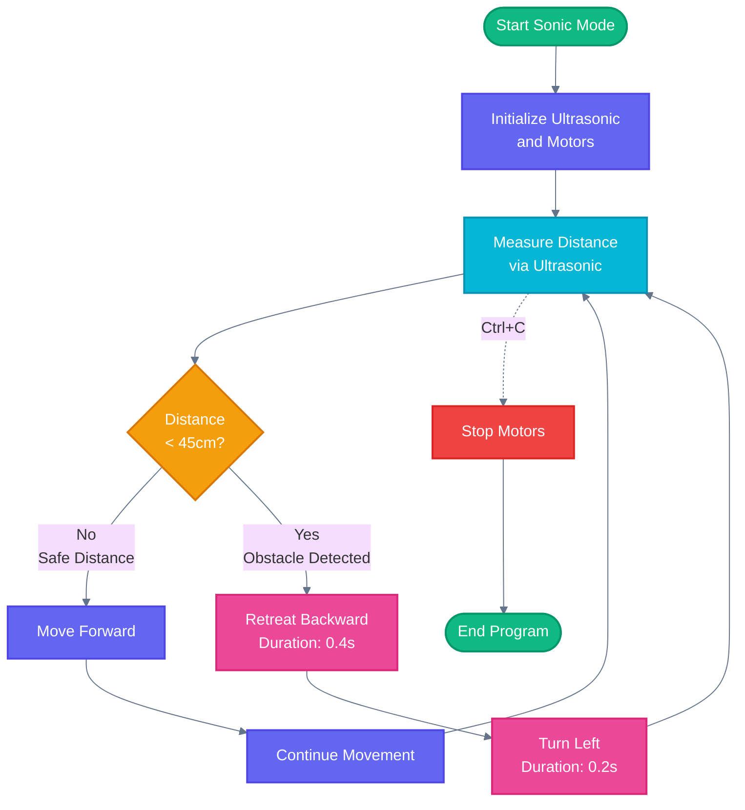
```mermaid
%%{init: {'theme': 'base', 'themeVariables': {'lineColor': '#64748b'}}}%%
flowchart TD
    classDef success fill:#10b981,stroke:#059669,stroke-width:2px,color:#ffffff
    classDef process fill:#6366f1,stroke:#4f46e5,stroke-width:2px,color:#ffffff
    classDef decision fill:#f59e0b,stroke:#d97706,stroke-width:2px,color:#ffffff
    classDef error fill:#ef4444,stroke:#dc2626,stroke-width:2px,color:#ffffff
    classDef info fill:#8b5cf6,stroke:#7c3aed,stroke-width:2px,color:#ffffff
    classDef critical fill:#ec4899,stroke:#db2777,stroke-width:2px,color:#ffffff
    classDef data fill:#06b6d4,stroke:#0891b2,stroke-width:2px,color:#ffffff
    classDef external fill:#64748b,stroke:#475569,stroke-width:2px,color:#ffffff

    START([Start Sonic Mode]):::success
    INIT[Initialize Ultrasonic<br/>and Motors]:::process
    MEASURE[Measure Distance<br/>via Ultrasonic]:::data
    CHECK{Distance<br/>< 45cm?}:::decision

    FORWARD[Move Forward]:::process
    RETREAT[Retreat Backward<br/>Duration: 0.4s]:::critical
    TURN[Turn Left<br/>Duration: 0.2s]:::critical
    CONTINUE[Continue Movement]:::process

    STOP[Stop Motors]:::error
    END([End Program]):::success

    START --> INIT
    INIT --> MEASURE
    MEASURE --> CHECK

    CHECK -->|No<br/>Safe Distance| FORWARD
    CHECK -->|Yes<br/>Obstacle Detected| RETREAT

    FORWARD --> CONTINUE
    CONTINUE --> MEASURE

    RETREAT --> TURN
    TURN --> MEASURE

    MEASURE -.->|Ctrl+C| STOP
    STOP --> END
```

As shown in the flowchart above, the robot operates in a continuous loop: measure distance, check if it's safe, and move accordingly. When an obstacle is detected within 45cm, the robot performs an avoidance maneuver.

### Run the Program

```bash
cd ~/Freenove_Tank_Robot_Kit_for_Raspberry_Pi/Code/Server
sudo python car.py Sonic
```

Press `Ctrl+C` to end the program.

### Behavior

- **Distance < 45cm**: The robot retreats for 0.4s, then turns left for 0.2s
- **Distance >= 45cm**: The robot moves forward

> **Warning**: In obstacle avoidance mode, only a single ultrasonic module is used. Observe the car's movement carefully. When misidentified, stop the car or pick it up immediately. Otherwise, the manipulator servo could be damaged, or even burn your Raspberry Pi expansion board.

---

## Chapter 5: Infrared Tracking Automatic Wrecker

The line tracking function uses the infrared module. When the sensor detects a black line, the corresponding LED lights up. The tank robot also detects obstacles using ultrasonic, and clears them with the gripper arm.

### Run the Program

```bash
cd ~/Freenove_Tank_Robot_Kit_for_Raspberry_Pi/Code/Server
sudo python car.py Infrared
```

> **Note for PCB V1.0 users** (non-Pi5): Run `sudo pigpiod` first.

Press `Ctrl+C` to end the program.

### Setup

1. Create a closed track using black tape
2. Place the car on the track
3. Run the code
4. After 1.5 seconds, the car starts automatically

### Line Following Logic

| Left Sensor | Middle Sensor | Right Sensor | Action |
|-------------|---------------|--------------|--------|
| High | Low | Low | Turn left gently |
| High | High | Low | Turn left |
| Low | High | Low | Go straight |
| Low | Low | High | Turn right gently |
| Low | High | High | Turn right |

### Obstacle Clearing

When the car detects an obstacle (5-12cm away) while following the line:
1. Stops
2. Grabs the obstacle with the gripper
3. Turns left
4. Drops the obstacle
5. Turns right
6. Continues line following

---

## Chapter 6: Smart Video Car

The smart video car integrates obstacle avoidance, line tracking, obstacle clearing, video transmission, ball tracking, and LED control. It consists of a **Server** (on Raspberry Pi) and a **Client** (on PC/Mac).

### Communication Protocol

The client and server communicate using a text-based protocol over TCP. Commands are sent as strings with `#` delimiters.

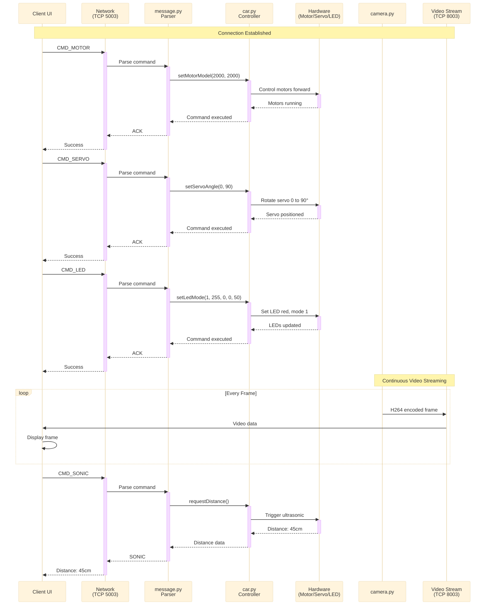
```mermaid
%%{init: {'theme': 'base', 'themeVariables': {'lineColor': '#64748b'}}}%%
sequenceDiagram
    participant C as Client UI
    participant N as Network<br/>(TCP 5003)
    participant M as message.py<br/>Parser
    participant Car as car.py<br/>Controller
    participant H as Hardware<br/>(Motor/Servo/LED)
    participant Cam as camera.py
    participant V as Video Stream<br/>(TCP 8003)

    Note over C,V: Connection Established

    C->>N: CMD_MOTOR#2000#2000
    activate N
    N->>M: Parse command
    activate M
    M->>Car: setMotorModel(2000, 2000)
    activate Car
    Car->>H: Control motors forward
    activate H
    H-->>Car: Motors running
    deactivate H
    Car-->>M: Command executed
    deactivate Car
    M-->>N: ACK
    deactivate M
    N-->>C: Success
    deactivate N

    C->>N: CMD_SERVO#0#90
    activate N
    N->>M: Parse command
    activate M
    M->>Car: setServoAngle(0, 90)
    activate Car
    Car->>H: Rotate servo 0 to 90°
    activate H
    H-->>Car: Servo positioned
    deactivate H
    Car-->>M: Command executed
    deactivate Car
    M-->>N: ACK
    deactivate M
    N-->>C: Success
    deactivate N

    C->>N: CMD_LED#1#255#0#0#50
    activate N
    N->>M: Parse command
    activate M
    M->>Car: setLedMode(1, 255, 0, 0, 50)
    activate Car
    Car->>H: Set LED red, mode 1
    activate H
    H-->>Car: LEDs updated
    deactivate H
    Car-->>M: Command executed
    deactivate Car
    M-->>N: ACK
    deactivate M
    N-->>C: Success
    deactivate N

    Note over Cam,V: Continuous Video Streaming

    loop Every Frame
        Cam->>V: H264 encoded frame
        V->>C: Video data
        C->>C: Display frame
    end

    C->>N: CMD_SONIC
    activate N
    N->>M: Parse command
    activate M
    M->>Car: requestDistance()
    activate Car
    Car->>H: Trigger ultrasonic
    activate H
    H-->>Car: Distance: 45cm
    deactivate H
    Car-->>M: Distance data
    deactivate Car
    M-->>N: SONIC#45
    deactivate M
    N-->>C: Distance: 45cm
    deactivate N
```

As shown in the sequence diagram above, each command follows a request-response pattern. The client sends formatted commands through TCP port 5003, which are parsed by `message.py` and executed by `car.py`. Video streams continuously through TCP port 8003 as an independent H264 stream.

### Server

#### Start the Server

```bash
cd ~/Freenove_Tank_Robot_Kit_for_Raspberry_Pi/Code/Server
sudo python main.py
```

> **Note for PCB V1.0 users** (non-Pi5): Run `sudo pigpiod` first.

A window will appear with "Server On". Click "Off" to stop, or close the window / press `Ctrl+C`.

#### Server Auto-Start (Optional)

1. Create startup script:
```bash
cd ~
sudo touch start.sh
sudo nano start.sh
```

2. Add content:
```bash
#!/bin/sh
cd "/home/pi/Freenove_Tank_Robot_Kit_for_Raspberry_Pi/Code/Server"
pwd
sleep 10
sudo python main.py
```

3. Save (`Ctrl+O`, Enter, `Ctrl+X`) and set permissions:
```bash
sudo chmod 777 start.sh
```

4. Create autostart directory and desktop file:
```bash
mkdir ~/.config/autostart/
sudo nano .config/autostart/start.desktop
```

5. Add content:
```
[Desktop Entry]
Type=Application
Name=start
NoDisplay=true
Exec=/home/pi/start.sh
```

6. Save and set permissions:
```bash
sudo chmod +x .config/autostart/start.desktop
sudo reboot
```

> To cancel auto-start, delete `start.sh` and `start.desktop`.

### Client

The client connects to the server via TCP, receives video stream, and sends commands.

#### Windows - Option 1: Executable File

Navigate to `Freenove_Tank_Robot_Kit_for_Raspberry_Pi/Application/windows/` and double-click `Client.exe`.

#### Windows - Option 2: Python Script

1. Install Python 3.8+ from https://www.python.org/downloads/windows/
   - **Important**: Check "Add Python to PATH" during installation

2. Install dependencies:
```cmd
cd D:\Freenove_Tank_Robot_Kit_for_Raspberry_Pi\Code
python setup_windows.py
```

3. Run the client:
```cmd
cd D:\Freenove_Tank_Robot_Kit_for_Raspberry_Pi\Code\Client
python Main.py
```

#### macOS / Linux

```bash
cd ~/Freenove_Tank_Robot_Kit_for_Raspberry_Pi/Code/Client
python3 Main.py
```

### Client Interface

1. Enter the Raspberry Pi IP address in the IP field
2. Click **Connect**
3. Click **Open Video** to start video stream
4. Use controls to operate the car

**Controls:**
- Movement: Forward, Backward, Turn Left, Turn Right
- Arm: Up, Down, Left, Right, Home
- Sliders: Servo 0 (horizontal), Servo 1 (vertical)
- LED: Mode 1-4, RGB values
- Modes: M-Free (manual), M-Sonic (obstacle avoidance), M-Line (line tracking)
- Actions: Pinch_Object, Drop_Object

**Keyboard Shortcuts:**
| Key | Action |
|-----|--------|
| W | Forward |
| S | Backward |
| A | Turn Left |
| D | Turn Right |
| Space | Stop |

### Ball Tracking

1. Click the **tracking** tab
2. Select ball color (Red, Green, Blue, or Custom)
3. Adjust HSV sliders for better recognition

**HSV Color Ranges:**

| Color | H- | H+ | S- | S+ | V- | V+ |
|-------|----|----|----|----|----|----|
| Red | 0/156 | 10/180 | 43 | 255 | 46 | 255 |
| Green | 35 | 77 | 43 | 255 | 46 | 255 |
| Blue | 100 | 124 | 43 | 255 | 46 | 255 |
| Yellow | 26 | 34 | 43 | 255 | 46 | 255 |

### Work Modes

The robot operates in three distinct modes, which can be switched via the client interface or by pressing the `Q` key.

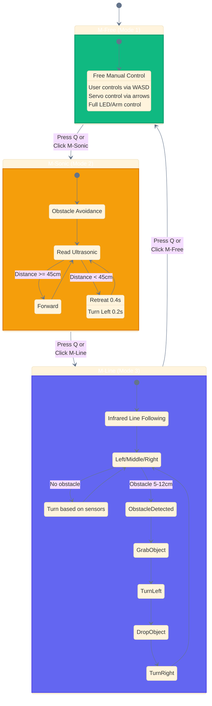
```mermaid
%%{init: {'theme': 'base', 'themeVariables': {'lineColor': '#64748b'}}}%%
stateDiagram-v2
    classDef freeMode fill:#10b981,stroke:#059669,stroke-width:2px,color:#ffffff
    classDef sonicMode fill:#f59e0b,stroke:#d97706,stroke-width:2px,color:#ffffff
    classDef lineMode fill:#6366f1,stroke:#4f46e5,stroke-width:2px,color:#ffffff

    [*] --> MFree
    MFree --> MSonic : Press Q or<br/>Click M-Sonic
    MSonic --> MLine : Press Q or<br/>Click M-Line
    MLine --> MFree : Press Q or<br/>Click M-Free

    state "M-Free (Mode 1)" as MFree {
        [*] --> Manual
        Manual : Free Manual Control
        Manual : User controls via WASD
        Manual : Servo control via arrows
        Manual : Full LED/Arm control
    }

    state "M-Sonic (Mode 2)" as MSonic {
        [*] --> Autonomous
        Autonomous : Obstacle Avoidance
        Autonomous --> CheckDistance
        CheckDistance : Read Ultrasonic
        CheckDistance --> Forward : Distance >= 45cm
        CheckDistance --> Avoid : Distance < 45cm
        Avoid : Retreat 0.4s
        Avoid : Turn Left 0.2s
        Forward --> CheckDistance
        Avoid --> CheckDistance
    }

    state "M-Line (Mode 3)" as MLine {
        [*] --> Tracking
        Tracking : Infrared Line Following
        Tracking --> ReadSensors
        ReadSensors : Left/Middle/Right
        ReadSensors --> AdjustPath : No obstacle
        ReadSensors --> ObstacleDetected : Obstacle 5-12cm
        AdjustPath : Turn based on sensors
        AdjustPath --> ReadSensors
        ObstacleDetected --> GrabObject
        GrabObject --> TurnLeft
        TurnLeft --> DropObject
        DropObject --> TurnRight
        TurnRight --> ReadSensors
    }

    class MFree freeMode
    class MSonic sonicMode
    class MLine lineMode
```

As shown in the state diagram above, the robot cycles through three operational modes:

| Mode | Function | Behavior |
|------|----------|----------|
| M-Free (Mode1) | Free control mode | User has full manual control via keyboard/UI |
| M-Sonic (Mode2) | Ultrasonic obstacle avoidance mode | Autonomously avoids obstacles using ultrasonic sensor |
| M-Line (Mode3) | Infrared tracking automatically clears obstacles mode | Follows black line and grabs/removes obstacles |

Each mode represents a distinct control strategy, and transitions occur when the user presses `Q` or clicks the mode button in the client interface.

### Full Control Reference

**Button and Key Mapping:**

| Button on Client | Key | Action |
|------------------|-----|--------|
| ForWard | W | Move forward |
| BackWard | S | Move backward |
| Turn Left | A | Turn left |
| Turn Right | D | Turn right |
| Left | ← (left arrow) | Turn camera left |
| Right | → (right arrow) | Turn camera right |
| Up | ↑ (up arrow) | Turn camera up |
| Down | ↓ (down arrow) | Turn camera down |
| Home | Home | Turn camera back Home |
| Connect/Disconnect | C | On/off Connection |
| Open Video/Close Video | V | On/off Video |
| Led_Mode 1,2,3,4 | L | Switch Led Mode |
| The car work modes | Q | Switch the car work modes |
| Pinch_Object | O | Pinch Object |
| Drop_Object | P | Drop Object |

**SliderBar Functions:**

| SliderBar | Function |
|-----------|----------|
| Servo 1, 2 | Slightly adjust servo angles |

**Other Controls:**

| Control | Function |
|---------|----------|
| IP address Edit box | Enter IP address of Raspberry Pi |
| R, G, B Edit box | Control the color of selected LED |
| Button "Ultrasonic" | Show the distance from obstacle |

### IP Address Memory

The program saves the IP address when entered for the first time. When reopened, it automatically fills in the last used IP address. The address is stored in the `IP.txt` file.

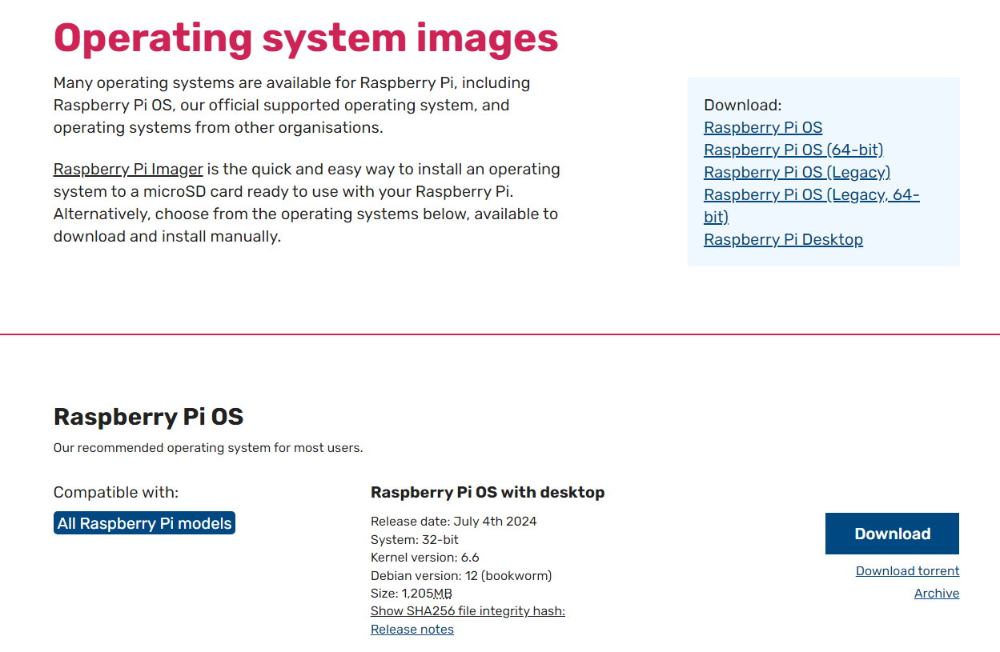
*First run shows "IP address" placeholder*


*After entering IP (e.g., 192.168.1.147), the address is saved*

### Run Client on macOS

#### Install Python 3

1. Download from: https://www.python.org/downloads/

> **macOS 11.0 or later**: Install Python 3.9
> **macOS under 11.0** (e.g., 10.15): Install Python 3.8

2. Select **macOS 64-bit installer** and download
3. Follow the installation wizard:
   - Click **Continue** through the screens
   - Click **Agree** to accept the license
   - Click **Install** (enter password if prompted)


4. After installation, Python 3.8 appears in Applications

#### Install Libraries

1. Download the code if not already present:
   ```
   https://github.com/Freenove/Freenove_Tank_Robot_Kit_for_Raspberry_Pi/archive/master.zip
   ```

2. Open Terminal and run:
   ```bash
   cd Downloads
   cd Freenove_Tank_Robot_Kit_for_Raspberry_Pi/Code/
   python3 setup_macos.py
   ```

3. Wait for installation. Success shows: **"All libraries installed successfully"**


4. **For macOS 11.0 or later only**, run:
   ```bash
   pip3 uninstall PyQt5
   pip3 install PyQt5
   ```

#### Run the Client

```bash
cd Client/
python3 Main.py
```

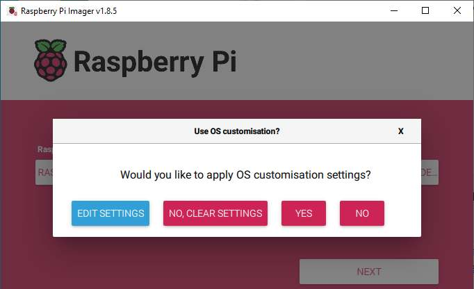

### Run Client on Linux (Raspberry Pi)

#### Install OpenCV Library

```bash
sudo apt-get install -y libopencv-dev python3-opencv
sudo apt-get install -y python3-pil python3-tk
```

#### Run the Client

```bash
cd ~/Freenove_Tank_Robot_Kit_for_Raspberry_Pi/Code/Client
sudo python Main.py
```

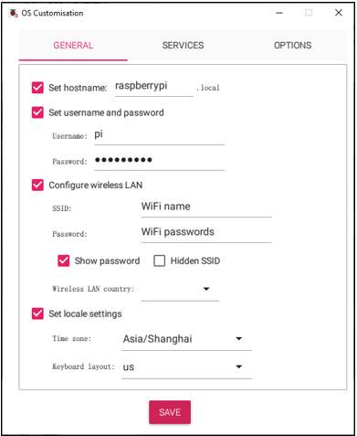

> **Tip**: If the image is not clear, check whether the camera protective film is torn off.

### Troubleshooting

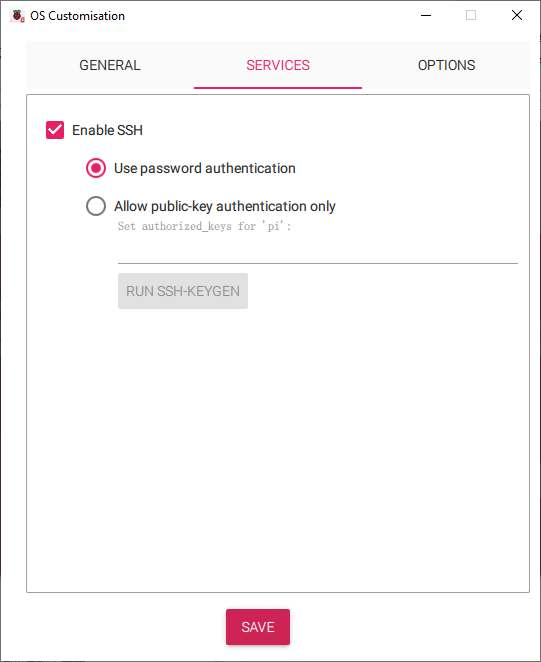

**If the car works abnormally, check:**

1. **Battery power** - Check the power indicator or recharge batteries
2. **Raspberry Pi system stuck** - Wait for recovery or reopen server and client
3. **Persistent issues** - Reboot the Raspberry Pi

> The latest Raspberry Pi official system may occasionally freeze. Older versions tend to be more stable.

**Support**: support@freenove.com

---

## Android and iOS App

### Download Links

**Android:**
- Google Play: https://play.google.com/store/apps/details?id=com.freenove.suhayl.Freenove
- GitHub: https://github.com/Freenove/Freenove_App_for_Android

**iOS:**
- Search "freenove" in the App Store

### Using the App

1. Open the app and select **Tank for Raspberry Pi**

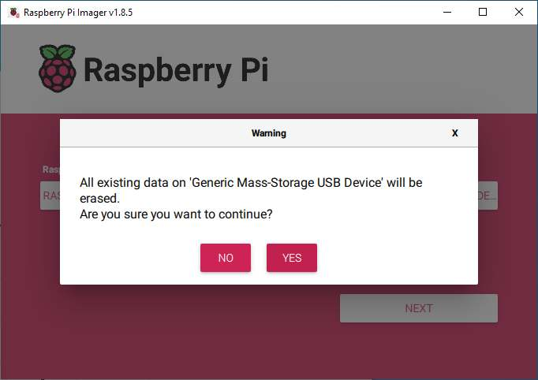

2. Start the server on your Raspberry Pi first
3. Enter your Pi's IP address
4. Connect and open video

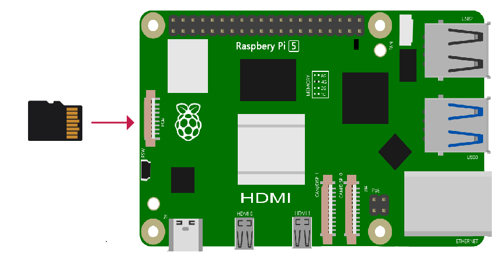

**App Controls:**
- **Joystick**: Drag the center dot to control car movement
- **Sliders**: Control arm height (Height) and gripper angle (Clip)
- **Mode buttons**: MOVE, SONAR, TRACKING
- **Pinch/Drop object**: Action buttons
- **Camera**: Take photos
- **RGB LED**: Control LED colors

---

## Free Innovation

If you want to write your own programs to control the car, follow this section.

> **Python Resources**: https://python.swaroopch.com/basics.html

### Setup Custom Programming Environment

1. Turn on S1 and S2 switches
2. Create a **Test** folder on the Raspberry Pi desktop
3. Copy these files from `Code/Server/` to the Test folder:
   - `Command.py`
   - `Led.py`
   - `Motor.py`
   - `servo.py`
   - `Ultrasonic.py`

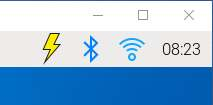

4. Open **Thonny Python IDE** (Programming → Thonny Python IDE)

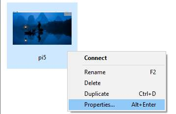

5. Create and save a new file `test_Code.py` in the Test folder

### Running Custom Code

```bash
cd ~/Desktop/Test
sudo python test_Code.py
```

### Code Examples

#### Motor Control

```python
from Motor import *

PWM = Motor()
PWM.setMotorModel(2000, 2000)  # Forward
print("The car is moving forward")
time.sleep(3)
PWM.setMotorModel(0, 0)  # Stop
```

#### LED Control

```python
from Led import *

led = Led()
led.ledIndex(0x04, 255, 255, 0)  # Yellow
led.ledIndex(0x80, 0, 255, 0)    # Green
time.sleep(5)
led.colorWipe(led.strip, Color(0, 0, 0))  # Turn off
```

#### Servo Control

```python
from servo import *

pwm = Servo()

# Servo rotates from 90 to 150 degrees
for i in range(90, 150, 1):
    pwm.setServoPwm('0', i)
    time.sleep(0.01)

# Servo rotates from 145 to 90 degrees
for i in range(145, 90, -1):
    pwm.setServoPwm('0', i)
    time.sleep(0.01)
```

#### Ultrasonic Module

```python
from Ultrasonic import *

ultrasonic = Ultrasonic()
data = ultrasonic.get_distance()
print("Obstacle distance is " + str(data) + " CM")
```

> **Note**: All code is written in Python 3. Execute with `python3` or `sudo python`.

These code modules can be integrated to create custom behaviors for your robot.

---

# What's Next?

Thank you for reading this tutorial.

If you find any mistakes, omissions, or have ideas and questions about the contents of this book or the kit, please contact us and we will address them as soon as possible.

## Extend Your Project

After completing this tutorial, you can:

- **Add modules** - Purchase and install other Freenove electronic modules
- **Modify the code** - Improve or customize functionality
- **Check for updates** - Visit our GitHub for new features: https://github.com/freenove

## Learn More

To learn more about Arduino, Raspberry Pi, smart cars, robots and other technology products, visit:

**Website**: https://www.freenove.com

**Support**: support@freenove.com

---

*Thank you for choosing Freenove products.*

